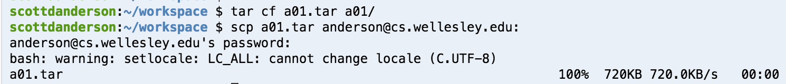
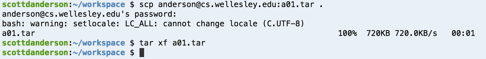
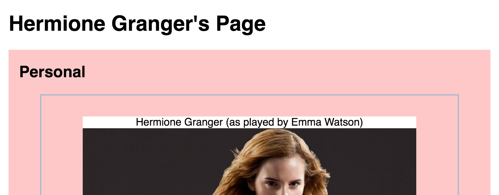
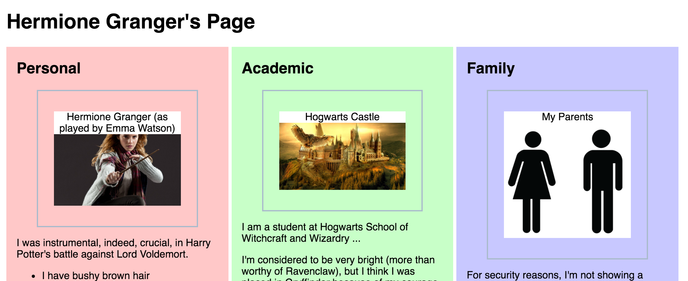

# Responsive Web Page

## Purpose

In this assignment, you'll show your command of these concepts and skills

* Flexbox
* Responsive web pages
* Media queries
* Absolute and Relative Positioning
* Validation
* Beginning JavaScript
    * Functions with arguments and return values
    * Arrays
	* Loops
	* Conditionals

This assignment builds on the one you did last time, which will save
you a lot of HTML and CSS typing. My example is Hermione Granger.

You'll revise the CSS and add some media queries so that there's a
different layout for wider devices. 

## Pair Programming

Pair Programming is encouraged for this assignment, but not
required. Please try to choose a different person from last
time. There may be people in the class whose schedule is incompatible
with yours, but there should be more than one whose schedule is
compatible. 

Choose one person to be the host and the other the guest and use her
workspace (though you should share the coding/typing duties). Either
person's code for assignment 1 can be the starting point for this
assignment.

If physical proximity is not possible when you work together, the host
can share her private workspace, read-write (RW) with the guest, so
that either person can edit the files. Remember to revoke the sharing
you did with whoever was your partner last time.

When the assignment is done, the host should revoke this sharing, so that
she can share her workspace with other people in later assignments. We
don't want to end up with every private workspace shared with everyone in
the class!

If you were the guest last time, here's how to copy the finished work
to your own C9 workspace:

1. In the workspace with the solution, create a tarfile with the work
in it:  `cd; tar cf a01.tar a01-done`
1. copy that tarfile to your account on Tempest:
`scp a01.tar youracct@cs.wellesley.edu:` Note the colon at the end of
that command; it's necessary

Here's how the first two steps might look:
<figure>

<figcaption>Creating tar file and copying to tempest</figcaption>
</figure>

Then, switch to your own workspace:

1. copy the tarfile from Tempest: `scp youracct@cs.wellesley.edu:a01.tar a01.tar`
1. untar it: `tar xf a01.tar`

Here's how the last two steps might look:
<figure>

<figcaption>Copying from tempest and un-tarring it</figcaption>
</figure>

That's it!

## To Do

You must do the following

* copy the directory for this assignment in your C9 workspace from the
previous solution:  `cp -r a01-done a02-work`
* Edit the CSS as specified below.
* Add a `script` tag to load the `rps.js` file that you will create 
* Write and debug the JavaScript code. 
* validate the result

## Styling

* Use a flexbox layout to make the three sections vertical for narrow devices.
* The caption for the three big figures has moved. It's now in front of the picture, overlapping the top of it
* The the background color is now opaque white, so that the text shows up
* The top, left and right edges of the caption box are flush with the image.
* The image is 80% of the figure, centered
* There's 2em of distance between the top figure border and the top edge of the image
* There's a screenshot below for how I'd like it to look. 

<figure>

<figcaption>The caption is in front of the top of the picture</figcaption>
</figure>

Note that I had to do a fair amount of fiddling around in order to get
this to look right. One thing to remember is that the padding inside
something is the same distance as the margin outside of a child.

Secondly, you have to make it responsive. If there's lots of
horizontal space (> 768px) it should switch to a three-column layout,
like this:

<figure>

<figcaption>Three column layout on wide devices</figcaption>
</figure>

## JavaScript

You have to write three JavaScript functions in the `rps.js` file. The
first is a fundamental building block of the Rock-Paper-Scissors (RPS)
game.  It must be named `compare` and it takes two arguments, both
strings. The two strings are moves in RPS, namely "rock", "paper", or
"scissors". The return value is:

* -1 if the first argument beats the second,
* 0 if it's a tie
* +1 if the first argument loses to the second

The second function takes no arguments. It's called `test_compare` and
it shows that the first function works, by trying all 9 possible
calling patterns and the return value. It does its output using
`console.log` so the output might look like:

```
for rock and rock compare returns 0
for rock and paper compare returns 1
for rock and scissors compare returns -1
for paper and rock compare returns -1
for paper and paper compare returns 0
for paper and scissors compare returns 1
for scissors and rock compare returns 1
for scissors and paper compare returns -1
for scissors and scissors compare returns 0
```

You could do this with 9 `console.log` statements, but you should use
an array of the three possible moves and loop over it.

Invoke this function in your `rps.js` file, so that we'll automatically see the output.

Finally, the last function named `test_sort` shows the funny behavior that sorting does
when we use the RPS comparison function you wrote. You will sort the following array:

```
:::JavaScript
var many_moves = ["rock", "paper", "scissors","rock", "paper", "scissors","rock", "paper", "scissors"];
```

The function should sort that array using the default comparison and
print the result, then sort it using your `compare` function and print
that. Invoke that function in your file as well.

Finally, add a comment at the end of your `rps.js` file explaining the
results of the sorting.

## Final Checklist

* Make sure your name is in the files, including `rps.js`. If you have a partner, *both* names should be in the files.
* Make sure everything works and looks nice
* Make sure both the HTML and the CSS are valid
* Fill out this [form](https://docs.google.com/a/wellesley.edu/forms/d/e/1FAIpQLSeaobYag3lesSo10kQqN2ViO1xJi4IqIkbrIVlIyglfbuhZ0g/viewform). That form will help me improve the course for next time. The form is anonymous; it will not collect your username.

## How to turn this in

In your C9 workspace, rename your working directory to a finished directory:

`mv a02-work a02-done`

then make it not writeable:

`chmod -R a-w a02-done`

Finally, touch the directory for the last time:

`touch a02-done`

