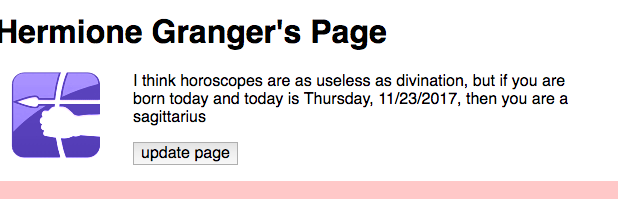

# Dynamic Web Page

## Purpose

In this assignment, you'll show your command of these concepts and skills

* JavaScript functions, arrays, and conditionals
* JQuery methods
* Date objects

The real work of this assignment is entirely in JavaScript, jQuery and the
DOM, but we need to have some HTML and CSS to work with. I'll give you a
choice:

* use your prior work in assignments 1 and 2, or
* make up a completely new page

Mine builds on the one I did last time, which will save me a lot of HTML
and CSS typing. My example is still Hermione Granger. If you choose to do
the same, here's how to copy it:

```
cp -r a02-done a03-work
chmod -R u+w a03-work
```

## Pair Programming

Pair Programming required. Please see the [collaboration document](https://docs.google.com/a/wellesley.edu/spreadsheets/d/1j2OovDGNy2IOdtfvNsYRLG2NwD_4MH_GIoPNryb3FtU/edit?usp=sharing)

## To Do

You must do the following

* Create an `index.html` file as your main page
* It should have a section (near the top) where we'll put some new
content, namely
    1. A place (like a `span`) to put the current date
    1. A place (like a `span`) to put someone's astrological sign
    1. A place (an `img`) to show their astrological sign
    1. A button (a `button` tag)
* Attach a `zodiac.js` file to your main html page
* Write the JS and JQ code described below to give the following behavior:
    1. A date is chosen randomly from an array of test values
    1. The date is used to determine the matching astrological sign
    1. The date is nicely formatted on the page
    1. The corresponding sign is also inserted into the page
* Those behaviors happen when the page loads, and
* Those behaviors also happen when the button is clicked.
* Validate the result

Here's a screenshot of my solution:

<figure>

<figcaption>The top of the page with zodiac information</figcaption>
</figure>

## JavaScript

You have to write several JavaScript functions in the `zodiac.js` file.

1. `makedate` which takes a string as its argument and returns a date object
1. `formatDate` which takes a date object and returns a string to format it like "Tuesday, 2/14/2017"
1. `zodiacSign` which takes a date object and returns the zodiac sign (the
following info from [12 zodiac
signs](http://www.psychicguild.com/horoscopes_explained.php)) as a
string. Note that the function returns just the name of the sign (the part
before the colon, below). 
    * aries: Mar 21-Apr 19
    * taurus: Apr 20-May 20
    * gemini: May 21 - June 20
    * cancer: June 21 - July 22
    * leo: July 23 - Aug 22
    * virgo: Aug 23 - Sept 22
    * libra: Sept 23 - Oct 22
    * scorpio: Oct 23 - Nov 21
    * sagittarius: Nov 22 - Dec 21
    * capricorn: Dec 22 - Jan 19
    * aquarius: Jan 20 - Feb 18
    * pisces: Feb 19 - Mar 20
1. `randomElt` that takes an array and returns a random element from the array
1. `randomDate` that randomly chooses a date string from an array of test
values of your choosing. This function should just reference an existing
array of test values, so it will not need any arguments.
1. `updatePage` that puts the above pieces together:  takes no arguments,
and it uses `randomDate` to get a string, uses `makeDate` to convert it to a date object, uses `formatDate` and `zodiacSign` to get strings to insert into the page and does so, and also inserts the correct image into the page.

You could find your own images for the signs of the zodiac, but I borrowed
the images used on the page above to make my solution. You're welcome to
download a [tarfile](../../downloads/zodiac.tar) of the images.
    
Hint: each file is named with the appropriate sign, so you can construct
the URL if you just know the sign.

In addition, you must write a "testing" function for each of the
following. (This idea is called [unit
testing](https://en.wikipedia.org/wiki/Unit_testing).)

1. `test_makeDate` which invokes `makeDate` for every element of your
array of test values and prints the result to the console. That will show
that (1) your test values are all parseable and (2) your `makeDate`
function works.
1. `test_formatDate` which invokes `formatDate` for every date derived
from your array of test values and prints the result to the console.
1. `test_zodiacSign` which invokes `zodiacSign` for every date and prints
the result.

Invoke each of these in your `.js` file so that we can see the results
just by opening the console.  


## Random Numbers and Elements

The basic building block of most random numbers is a number uniformly
distributed between zero and one.  (Like from 0.0000000 to 0.9999999.)
Let R stand for such a number.  We can get one from `Math.random()` which
is built-in to JavaScript.

To flip a coin, we need to convert that kind of value to two distinct
values. If we multiply R by 2 (two distinct values) and take
`Math.floor()` of it, we get two integer values: 0 and 1. That's all we
need.  The `Math.floor()` function is built-in to JavaScript, and it
converts a floating point number into an integer by chopping off the part
after the decimal point.

To roll a six-sided die, we multiply R by 6 (six distinct values) and take
`Math.floor()` of the result, yielding an integer in the set {0, 1, 2, 3,
4, 5}. Add one to that, and we're done.

So, to find a random element of an array, just generate a random index
into the array.


## Final Checklist

* Make sure your name is in the files, including the HTML file and the JS file. If you have a partner, *both* names should be in the files.
* Make sure everything works and looks nice
* Make sure both the HTML and the CSS are valid
* Fill out this [form](https://goo.gl/forms/gGYPnuELLl0Ne1jU2). That form will help me improve the course for next time. The form is anonymous; it will not collect your username.

## How to turn this in

In your C9 workspace, rename your working directory to a finished directory:

`mv a03-work a03-done`

then make it not writeable:

`chmod -R a-w a03-done`

Finally, touch the directory for the last time:

`touch a03-done`

