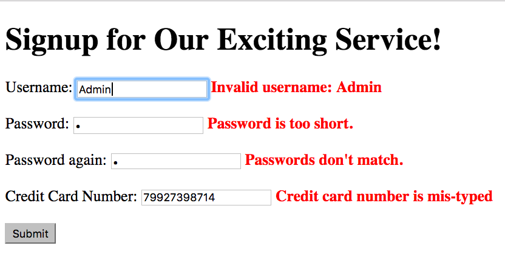
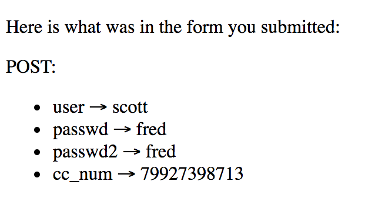

# Assignment: Signup

We've all filled out countless forms to sign up for various web
services. Even the Cloud 9 accounts required some elaborate signup
forms. In this assignment, you'll write some JavaScript code to
validate a signup form, checking its values certain common errors.

This assignment is intended to be relatively little coding. My
solution is only 25 lines of JavaScript, plus some HTML and CSS and
some editing of other JS files.

## Goal

You'll build a web page that contains a form for signing up for
something. There will be an input for the username, two for the
password (to make sure they can type it twice correctly) and one for a
credit card number. There will also be a submit button to submit the
form. You can add some simple CSS to make the form look nice, but
you need not put much effort in this (I didn't).

## Validation

To validate a form, we'll look for common errors. In this case, there
will be just a few error checks:

1. Check that the username is not one of a handful of prohibited
values, namely "admin", "root", and "super".  You should keep the
keep the prohibited values in a global list, so that it's easy to
add or change the values without having to modify your code. Your
code should ignore case, so "Admin" and "ROOT" as also prohibited.
1. Check that the password is not less than some minimum length, given
in another global value. This allows us to easily change the
minimum without having to dig into the code.
1. Check that the second password matches the first.
1. Check that the credit card number is valid according to the Luhn
test (see below).

If any of these tests are not passed, an error message should be
inserted onto the page and the form should *not* be submitted (since
there are errors).

If all of the tests are passed, the form should be submitted. The
`action` of your form should be
`https://cs.wellesley.edu/~cs210/form-echo-html.php`. That script just
echoes the values back to you, but it's useful for testing.

## Luhn Module

The Luhn algorithm is a kind of checksum, meaning that its purpose is
to make sure there hasn't been a typographical error or similar sort
of error. It's not a security measure or an encryption algorithm. You
can read a lot about it in the Wikipedia page on the
[Luhn Algorithm](https://en.wikipedia.org/wiki/Luhn_algorithm).

You don't have to implement the algorithm; I've already done that for
you in [Lunh.js](Luhn.js).

What you have to do is copy that code to your own account and use it.

I have also done this so that you can see one technique that is used
to implement modules in JavaScript. Here's a high-level look at the
code:

```
:::JavaScript
var Luhn = (function () {

    function digits_of(number,step,init) {
        ....
    }
    
    function sum(array) {
        ...
    }

    function checksum(card_number) {
        ...
    } 

    function is_valid(card_number) {
        return checksum(card_number) == 0;
    }
    
    function test() {
        console.log('should be true:  '+is_valid('79927398713'));
        console.log('should be false: '+is_valid('79927398714'));
    }
    
    // here are the exported values
    return { checksum: checksum, is_valid: is_valid, test: test };
})();
```

We'll talk more about this in class, but you can see that the global
variable `Luhn` is the value returned by the IIFE, which is an object
that contains 3 properties, each of which is a local function of the
IIFE. Thus, we can use functions like `Luhn.checksum` and `Luhn.is_valid`.

After you copy the Luhn code, modify it so that `sum` is also
exported. Write a function to test the `sum` function.

## Modularity

You must use the `formhandler.js` file that was created in Chapter 10
of your book. Use that code to attach your own submission handler to
your form. Here's a copy of the code: [formhandler.js](formhandler.js)

However, you will have to make some small changes to that
code:

1. It should not always prevent the form submission. Instead, your
submission handler will decide whether to submit the form.
1. It will have to pass the event object to your handler, so that your
handler will be able to prevent the default or not.
1. It should not reset the form. Otherwise, a correctly filled out
form will be submitted as a blank form. (Try it!)

## Hints

I suggest you work as follows:

1. First create a rudimentary form in an HTML file that also loads
jQuery. Test that it works with the echo script
1. Add the formhandler.js file. Attach a dummy submission handler that
just does a `console.log` and get that to work.
1. Implement just a single validation test. Choose the easiest one,
   such as password length. Get working the error messages and the yes/no
   decision about whether to submit the form.
1. Incrementally improve your submission handler to cover the other
tests, saving the Luhn test for last.
1. Add the `Luhn.js` file and make the changes described
   above. Convince yourself that the Luhn code works in the JS
   console.
1. implement the Luhn validation.
1. Sigh in relief, exchange a high-five with your partner, and you're
done.

## Screenshots

Here are two screenshots, with and without errors.

<figure>

<figcaption>A screenshot after I made as many errors as I
could.</figcaption>
</figure>

<figure>

<figcaption>A screenshot after I submitted a form with no errors.</figcaption>
</figure>

## Feedback

Please fill out this [form](https://docs.google.com/a/wellesley.edu/forms/d/e/1FAIpQLSc1I-ZEY-h3Y-3YZHOZGxSgSuU3tydaDmsx3XwAVbia8D8fvg/viewform)

That form will help me improve the course for next time. The form is anonymous; it will not collect your username.

## How to turn this in

In your C9 workspace, rename your working directory to a finished directory:

`mv a07-work a07-done`

then make it not writeable:

`chmod -R a-w a07-done`

Finally, touch the directory for the last time:

`touch a07-done`

