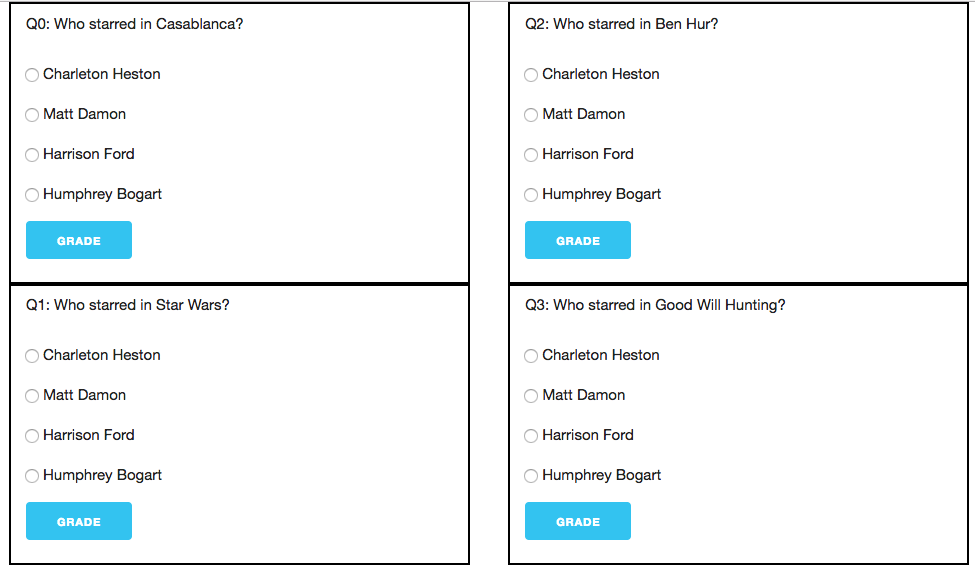
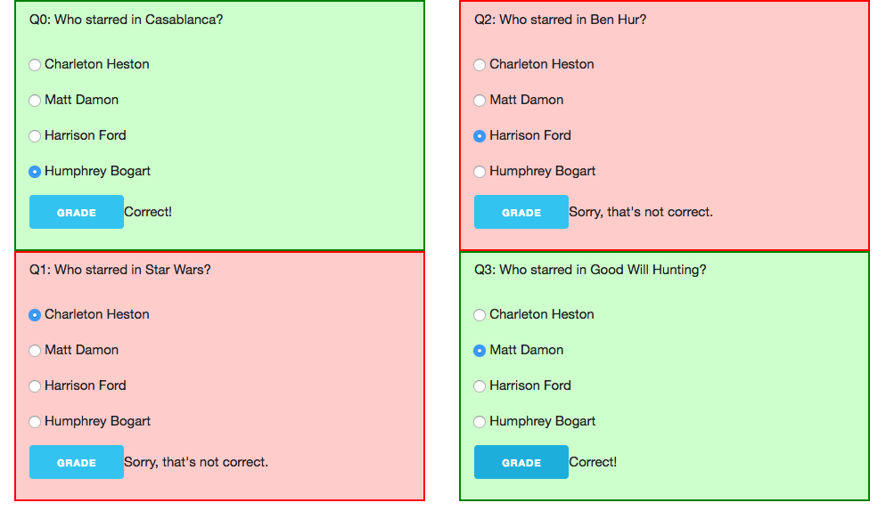

# Assignment: Quiz

We regularly take multiple-choice quizzes using Sakai.  In this
assignment, you will write an application that formats quiz questions into
a bunch of radio button sets and allows the person to answer the questions
and "grade" their answers.  We won't keep track of the score, but if we
wanted to, we could use kind of code we did with Rock-Paper-Scissors.

## Goal

In this assignment, you will use grid systems, you will dynamically create
quiz questions from a list of information, and you will add an event
handler to which you will delegate all the grading.

## Dependencies

This assignment is based only on the material up to and including Chapter
11, in which we learned to dynamically add a checkbox to the page.

## Operation

The app will work like this:

When the page loads, a global variable will be defined that contains a
list of multiple-choice questions in JSON format. Here are some [example
questions](questions.js). You're welcome to use those, or write your own.

Each question looks like this:

```
:::JavaScript
var questions = [ 
    {Q: "Who starred in Casablanca?",
        A: "Charleton Heston",
        B: "Matt Damon",
        C: "Harrison Ford",
        D: "Humphrey Bogart",
        ANS: "D"
    },
...
];
```

There's the question (Q), four answers (A-D) and the answer (ANS).

Your code will iterate over that list of questions and format them onto
the page. The page will have two columns using some kind of grid system,
and the first half of the questions go in the first column and the second
half of the questions in the second column.

Each question will be nicely formatted as a paragraph and a group of four
radio buttons for that question. There will also be a button to grade each
question. Here's a screenshot:

<figure>
   
   <figcaption>A nicely formatted page of questions</figcaption>
</figure>

Once the page is loaded, the user can choose radio buttons and click on
the "grade" button. If their choice is correct, the question is marked
correct by adding "correct" CSS class and inserting an appropriate
message. Similarly, if it's incorrect, it's marked by adding a "wrong"
class and an appropriate message. My classes changed the border and
background color, like this:

<figure>
   
   <figcaption>A nicely formatted page of answered questions, marked right
   or wrong using color.</figcaption>
</figure>

## Implementation

Your HTML page should be named `quiz.html`. It will load jQuery, the
`questions.js` file above (feel free to modify the questions) and two
others:

* `Question.js` will define a new kind of object called `Question`. The
constructor will take an object literal like the one above, describing
just one question, create the DOM structure for the question, similar to
the `Row` constructor from Chapter 11. It will
also have a method to add a question to the document.
* `quiz.js` which will do two things:
    * Iterate over the array of questions, creating objects for each
    question and appending them to the document in either the first or
    second column. The first half of the list should go in the first
    (left) column, and the second half of the list should go in the second
    (right) column.
    * Add an event handler to some appropriate ancestor of all the
    questions, delegating the click-handling for all the "grade" buttons.
    That click handler should determine whether the user got the question
    right, and add the appropriate class (and removing the other class, if
    any).

## Question Construction

Constructing the DOM element for a question is a fair amount of code, but
not conceptually difficult. Look at the `Row` constructor for some
inspiration.

I strongly suggest that you work backwards from the HTML.  That is:

1. Write out the HTML that your function needs to create.
1. Identify the elements and their parent-child relationships.
1. Identify which parts are static and which parts will depend on
information from the question (object literal).
1. Construct the elements and use `.append()` to establish the
parent-child relationships.
1. Store the branch in an instance variable for later.

Note that each set of radio buttons will have to have a shared name. I
suggest `"Q"+i` where `i` is the index of the question in the
array. Therefore, the constructor will have to have two arguments: the
object literal describing the question and the index.

The `Question` object must also have a method called `addToDOM` that takes
an argument that is a DOM element to append the question to.  This is a
slightly different interface than our book uses.

## Event Handling

The event handling is not a lot of code, but it's tricky. Here are some
sub-problems to solve:

* How will the event handler know what the answer to this question is?
  Remember that the handler is responsible for grading all the questions. I
  suggest storing the correct answer in an element, using a `data-answer`
  attribute. That will affect the HTML for the Question construction.
* How will the event handler find the element that has the `data-answer`? This
  will undoubtedly require searching the tree, probably upward from the
  event target.
* What will the event target be? What click events will be
  delegated to this handler?
* How will the handler know what answer the
  user gave? We saw how to use the `.val()` method in class. You might
  consider using `.find()` as well.

Once you've answer those questions, I think you'll find that the code is
something like:

```
:::JavaScript
var correct = [code to find correct answer]
var given = [code to find answer user gave]
if( correct == given ) {
    [code for marking it correct]
} else {
    [code for marking it wrong]
}
```

## Hints

I found I had to use all of the following jQuery methods:

* `.attr()` to get an attribute
* `.closest()` to search up the tree
* `.find()` to search down the tree
* `.val()` to get the value of an input
* `.text()` to set the text in an element
* `.addClass()` to add a CSS class to an element
* `.removeClass()` to remove a CSS class to an element if it's there
* `.append()` to add a child to a parent element


## Modularity

Making the questions and adding the event handler should be done with
functions. Once your code is working, bundle them up in an IIFE.

Each button of the radio button groups is identical in structure. You
should define a function that creates one and invoke it four times. That
function should not be global.

## Feedback

Please fill out this [form](https://docs.google.com/a/wellesley.edu/forms/d/e/1FAIpQLSd7YBRZMcZ-S-HQEtjBwlzsrBmmG0Qqr2S0wRx8JCbQF8abGA/viewform?usp=sf_link)

That form will help me improve the course for next time. The form is anonymous; it will not collect your username.

## How to turn this in

Do all your work in a new folder called `a08-work`.

When you are done, rename your working directory to a finished directory:

`mv a08-work a08-done`

then make it not writeable:

`chmod -R a-w a08-done`

Finally, touch the directory for the last time:

`touch a08-done`


