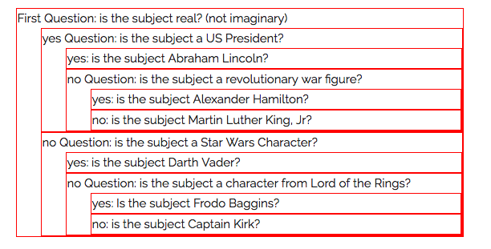

# Assignment: Twenty Questions

Back before ubiquitous electronic entertainment, people would play parlor
games, including "20 questions".  The idea of the game is simple. One
person, let's call them the oracle, thinks of something: person, place, or
thing.  The other people can ask the oracle yes/no questions. If they can
guess the target within 20 questions, the asker(s) win, otherwise the
oracle does.

My daughter was recently playing this on my phone, using an app called
*Akinator the Genie*.  You can blame her for this assignment, since I
think it would be fun to build a 20 questions game, where the computer
plays the asker and the human is the oracle.

Since these are yes/no questions, the game play amounts to searching a
binary tree. The nodes are questions, and the leaves are guesses
(answers). With 20 questions, you can reach 2<sup>20</sup> or about a
million possible answers.

Implementationally, the game will be represented as a literal tree, using
JavaScript objects. (But no methods.)

Later in the semester, we'll build a "learning" version of the game, where
when the computer fails, it can ask for the correct answer and a question
to distinguish the failed guess from the correct answer, and update its
tree. 

## Goals

This assignment will demonstrate your skill with:

1. Ajax (we'll fetch the tree from a server)
1. Recursive tree traversal (we'll print the tree)
1. Maintaining your place in a tree data structure (necessary for playing
the game)
1. Dynamic element creation (you'll dynamically add questions and buttons
to the page, and remove unneeded buttons)
1. Event delegation (to answer the questions and update the display)

Note: this is a pretty hard assignment. Start early and ask questions.
It's not a huge amount of code, though. My implemenation, including blank
lines and comments and such, is less than 200 lines of code. 

## Dependencies

This assignment is based only on the material up to and including Chapter
13 (Ajax) and very little on Ajax.

## Operation

There are three distinct aspects that you will implement:

1. Fetching the text from the server using Ajax and parsing it into a tree
1. Displaying and hiding the tree
1. Playing the game

The last two depend on the first, but not on each other, so you can attack
them in either order.

Here's a video showing all of this.

<video controls style="width:50%;border:1px solid black">
    <source src="20qs.mp4" type="video/mp4">
    Your browser doesn't support the video tag
</video>

The app will work like this:

When the page loads, it'll have buttons for the following:

1. Get a tree from the server
1. New Game
1. Show Tree

Initially, the first button is the only one that will work. It uses an
Ajax request to load the tree from the server as a string and parse it
into a JSON data structure. After the tree is loaded, both of the other
two buttons will work.

## Tree Structure

Internally, the question tree will be a tree of JavaScript objects, but
that's inconvenient for writing (actually, it's not so bad...).
Nevertheless, I created a format that is a little easier to write.

Here's an example of the [file format](tree1.text).  Feel free to copy that
file and feel free to modify it.

I will supply you the function to parse that file format and create a JSON
tree structure.  I called that file [parseTree.js](parseTree.js)

Each tree node looks like this:

```
:::JavaScript
    {Q: "Is it bigger than a breadbox?",
     Y: ...,
     N: ...
    }
```

The two attributes, `Y` and `N` are either other tree nodes or strings. If
they are a string, they are a *guess* (an answer). Here's a node with two
guesses:

```
:::JavaScript
    {Q: "Is it bigger than a breadbox?",
     Y: "Is it a car?",
     N: "Is it a cellphone?"
    }
```

It's possible for either child to be a string and the other a node; they
don't have to simultaneously be strings.

## Bypassing the Ajax Loading

The task of loading the text file using Ajax and parsing it is important,
but can be a stumbling block to getting to the other tasks.  Therefore, I
have provided a way to bypass that step while you continue to work on it.

The bypass is a JavaScript file that assigns a global variable, `tree1`,
to JavaScript data structure exactly like the one produced by
`parseTree`. Here is a copy of [tree1.js](tree1.js), which you are welcome
to use for the second and third tasks while you work on the first task.

## Tree Display

One task is to write a function that will take the current tree and print
it on the page in a nicely indented way. You'll do this by creating nested
DIVs.  Here's a screen shot where I've changed the border to red to make
the divs visible:

<figure>
    
    <figcaption>The tree as nested DIVs</figcaption>
</figure>

The inner working of your function will be a recursive function that takes
a tree node as an argument and returns a DOM element (unattached).

You'll wrap that up in a main function that takes a selector and a node as
its arguments, and it will use the recursive function to build some
structure, then attach that structure to the element named by the
selector. Eventually, the second argument will be the root of the whole
tree, but you can supply subtrees when you're debugging.

Add an event handler for the "show tree" button that renders the tree to
some (empty) place on the page.  It should also update the button to say
"hide" and have the opposite functionality.  If you have trouble with
that, just have two buttons.

## Game Play

To play the game, you'll implement a number of buttons, each one handling
a yes/no question.  Actually, you'll delegate all the work to a few
handler functions.

Here are some aspects of the implementation:

### Ask the Next Question

You should implement a function that takes one node as an argument and
asks the question or makes the guess associated with that node. This will
involve:

* building some structure to hold the question/guess text and two buttons (for
  yes and no). I did mine with cloning, find, and text, but you can also
  do it by building structure.
* appending that structure to the list of questions

The game will start with that function being invoked with the root of the
tree. As the game proceeds, that function will be invoked with children of
the current node.

### Processing an Answer

You'll write an event handler for clicking on the "Yes" that does the
following:

* removes both buttons
* chooses the correct child, and
* asks the next question (see the previous function)

Write a nearly identical function for "No". These will not be lengthy
functions.

### Processing a Guess response

Two more functions will be necessary to handle the final yes/no question:
correct and incorrect guesses. (I implemented them as different buttons,
but you could use the same pair as before; there are many ways to attack
this problem.) They will:

* remove both buttons
* insert an appropriate response (Yay or Boo)

### Delegate

Attach these as event handlers on an ancestor to all the questions, so
that the clicks will bubble up and have the correct action applied.

### Starting the Game

Have a button that starts the game by asking the first question.  It
should probably clear out whatever is left from the previous game.

## Hints

You can test whether a node is a question or a guess by checking to see if
it's a *string*. Here's how:

```
:::JavaScript
if( typeof( node ) === 'string' ) ...
```

## Modularity

This assignment is hard enough, so don't worry about packaging things up
in modules.

## Feedback

Please fill out this [form](https://docs.google.com/a/wellesley.edu/forms/d/e/1FAIpQLSd4RgNtR-yx2mfFs6N2kpg9SBA6rLzIWWo54hOGMBmhbNR2UA/viewform?usp=sf_link)

That form will help me improve the course for next time. The form is
anonymous; it will not collect your username.

## How to turn this in

Do all your work in a new folder called `a09-work`.

When you are done, rename your working directory to a finished directory:

`mv a09-work a09-done`

then make it not writeable:

`chmod -R a-w a09-done`

Finally, touch the directory for the last time:

`touch a09-done`


