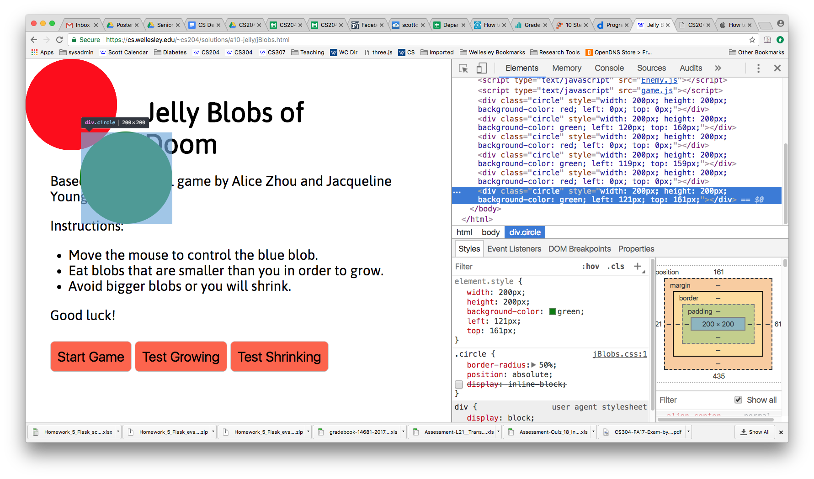

# Jelly Blobs of Doom

For this assignment, we'll implement a delightful game that Alice Zhou and
Jacqueline Young created for CS 111 in Python, and Alice adapted to
JavaScript.  I rewrote and refactored the game, but most of the credit
goes to Alice, and I'm grateful for her work on this.

The instructions for the game are quite simple:

* Move the mouse to control the blue blob
* Eat blobs that are smaller than you in order to grow
* Avoid bigger blogs or you will shrink

## Goals

The educational goals for this assignment are primarily to use OOP and
inheritance in your implementation.

There are three entities that you will have to implement:

1. Blobs
1. Enemies
1. the Player

Both Enemies and the Player are subtypes of Blobs.

In addition to implementing these three objects, you'll define a
mouse-movement event handler and you'll work with jQuery animations.

Warning, this is another difficult assignment. But I have faith that
you'll be able to do it, and, besides, it's a fun game. In total, my
solution has about 300 lines in the JavaScript files, including
blank lines and comments.

## Game Play

Here's a screencast of the game play, along with two testing modes:

<video controls style="width:100%;border:1px solid black">
    <source src="jBlobs.mp4" type="video/mp4">
    Your browser doesn't support the video tag
</video>

## Blobs

Blobs have instance variables to keep track of

* their color (though it never changes)
* their diameter and radius (the player's diameter dynamically changes,
but enemies don't
* the x and y location of their center (changes for both subclasses)
* the DOM element that corresponds to the blob.

The DOM element is quite simple:

```
:::HTML
<div class="circle"></div>
```

The CSS is where all the magic occurs:

```
:::CSS
.circle {
    border-radius: 50%;
    position: absolute;
}
```

Because the border-radius is 50% (of the width of the DIV), the DIV will
be a circle. The `position:absolute` will position the DIV on the page
(you *could* have a smaller playing area, but we'll use the whole
document).

I implemented the constructor to have two arguments, `color` and
`diameter`; I also implemented the following methods. Some might be
unnecessary, but I wanted to be complete.

* `addToGame` which adds the blob to some container.
* `setColor` which *also* needs to update the DOM element's CSS
* `setDiameter` which *also* needs to update the DOM element's width,
* height, left and top attributes.
* `setRadius` is similar to `setDiameter`
* `getDiameter` reports the value
* `getRadius` reports the value
* `getX` and `getY` report the x,y coordinates of the center
* `setX` and `setY` change the x,y coordinates of the center and update
the position of the DOM element

I will give you the following code, which determines whether two circular
Blobs intersect. It uses the Pythagorean theorem to compute the distance
between their centers (d), and then compares that to the sum of the two
radiuses (r1+r2). Essentially, we want to return `true` if and only if:

d < r1+r2

However, the Pythagorean theorem requires us to compute d as the square
root of the sum of two squares. The square root function is relatively
expensive (try computing one by hand, without a calculator). So, we use a
trick: we square both sides of that inequality, and we return `true` if
and only if:

d^2 < (r1+r2)^2

Here's the code:

```
:::JavaScript
Blob.prototype.intersects = function (other) {
    var dx = this.getX() - other.getX();
    var dy = this.getY() - other.getY();
    var distance_squared = (dx * dx + dy * dy);

    var r1 = this.getRadius();
    var r2 = other.getRadius();
    var rsum = r1+r2;
    var closer = (distance_squared <= rsum*rsum);
    return closer;
};
```

## Player Object

There will only be one instance of the Player object, but we'll define it
as a class anyhow. (Maybe there will be a multi-player version
someday...). Its constructor can have the same arguments as `Blob`. The
player will have all the behavior of Blobs, plus the following methods

* `move` which takes a mouse movement event object (see below) as its
  argument and moves the DIV so that the center is in the new location.
* `grow` which increases the diameter by `growDiameter` pixels. 
* `shrink` which decreases the diameter by `shrinkDiameter` pixels
* `collide` which is invoked when a collision happens. It takes an enemy
  blob as an argument and either grows or shrinks the player as
  appropriate

The `grow` and `shrink` methods also compare the new size to some
limits. If the limit is exceeded, the game ends, with the player winning
or losing.

Here are some key values:

```
:::JavaScript
var winningDiameter = window.innerHeight/2; // bigger than this wins
var losingDiameter = 5;                     // smaller than this loses
var growDiameter = 20;                      // grow by this many pixels
var shrinkDiameter = 5;                     // shrink by this many pixels
```

## Enemies

Enemies have some interesting and complex behavior, since they are
autonomous.

The constructor of an enemy takes no arguments and does the following:

* gives it a random color and a random diameter
* determines its direction
* sets its initial location

The enemy blobs always move in a straight line directly across the window,
so if they come in from the left, they go in a horizontal line and exit on
the right. Their `y` (`top`) coordinate never changes.  (You can imagine
many fun improvements and variations on this game.)  Choose their
direction or starting side randomly among the four possibilities.

Enemy blobs can collide with the Player. (You can assume that the player
object is stored in a global variable. There are better ways to organize
the code, but this will do.)

Oddly and asymmetrically, the Player can collide with enemies without
harm, but if an enemy collides with the Player, then the Player is
affected. In other words, when an enemy moves, it checks to see if it has
collided with the player, but when the Player moves, it doesn't check to
see if it has collided with any enemies. This rule, odd as it is, has the
advantage that an enemy only has to check *one* other blob for collisions,
while a player would have to check against every enemy. This rule means
that the player code doesn't have to worry about all the enemies (the
*human* player does).

Furthermore, enemies can only collide with the Player once. This means,
for example, that if the enemy moves over the Player in ten steps, that
doesn't count as ten collisions. To implement this rule, an enemy will
have to keep track of whether it has collided with the Player, and if it
has already collided, skip any further collision checking.

Whenever an enemy moves, it does the following:

* updates the values of X and Y from the DOM object. As we'll see later,
  jQuery animations modify the CSS properties, and our code will have to
  extract the values of `top` and `left` in order to determine the center
  of the blob, so that the `intersects` algorithm above can be used.
* it then uses the `intersects` method on itself and the Player. If that
  indicates that an collision has occurred, it
* invokes the Player's `collide` method, described above

Setting initial coordinates is a bit tricky. Essentially:

* if the blob is moving vertically, choose its X coordinate randomly
  between the left and right edge of the window (0 and
  `window.innerWidth`). The Y coordinate is chosen so that the blob is
  initially just off screen.
* if the blob is moving horizontally, choose its Y coordinate randomly
  between the top and bottom edge of the window (0 and
  `window.innerHeight). The X coordinate is chosen so that the blob is
  initially just off screen.

The enemy has a `remove` method that stops the animation and removes the
DOM element from the document.  This method is used by the Player when it
eats a smaller blob or when the animation is done.

The enemy has a `start` method that starts its animation going. So, in a
moment, we'll turn to animation to learn more.  First, though, here are
some values you might want:

```
:::JavaScript
var minDiameter = 5;                   // random size >= this
var maxDiameter = window.innerWidth/4; // random size <= this
var enemyDuration = 5000;              // time to cross the document
```

Here's a complete list of the methods of the methods I implemented for my
Enemies objects:

* `collide` which is invoked when a collision happens and it records that
the enemy has collided with the Player and informs the Player of the fact.
* `maybeCollide` which checks for a collision. It's invoked during the
animation of the movement of the enemy. The method first checks to see if
this enemy has collided with the Player in the past and if so, skips any
further processing. If it hasn't collided in the past, it updates the X
and Y location, checks to see if there is an intersection (using the
`intersects` method above) and if so, invokes the `collide` method that we
just discussed.
* `setCoords` which sets the initial X,Y coordinates of the enemy, based
on the side it enters from and what testing mode we are in. This method is
invoked from the constructor.
* `remove` which removes this enemy from the board
* `start` which starts the jQuery animation of this enemy moving across
the board.

## jQuery Animation

Animation in jQuery is very cool and powerful. You can read a ton about
the [animate method](https://api.jquery.com/animate/) on the jQuery site.

I used a version of the jQuery `animate` method that looks like this:

```
:::JavaScript
$(elt).animate({ left: "+=456px"}, options);
```

That method starts moving the element by adjusting its `left` CSS property
until it is 456 pixels bigger than it is currently. Obviously, you won't
use exactly that code, but that example should get you going.

The `options` argument in a JS object literal that can have many
properties. I used three:

1. `duration` a time in milliseconds for the animation to take
1. `progress` a function that jQuery invokes at every step of the
animation. This is a good time to check for collisions. If you want to use
a method of an object, you might need to use the `bind` method that we
learned.
1. `complete` a function that jQuery invokes when the animation is
done. Again, you might need to use `bind` here.

## Animation and our Model

The jQuery animation happens separately from our JavaScript
code. (Technically, it happens in what is called a different *thread*.)
The jQuery animation incrementally updates the `top` or `left` CSS values
of the DOM object (the `div.circle` that we discussed above). By default,
the jQuery animation does not update anything in our `Blob` object: no
instance variables are modified.

Let's take a concrete example to explain what is going on. Suppose we have
a blob with a radius of 10. It starts out nestled snugly in the upper left
corner of the screen, so the CSS looks like `top:0px;left:0px` and the
`Blob` object has instance variables recording that the center of the blob
is at (10,10).

We then start an animation where the blob is moving diagonally across the
screen. After a while, the CSS values will be `top:800px;left:800px` but
the `Blob` object's instance variables still have the center at
(10,10). That's because the animation only updates the CSS values we asked
it to, nothing else.

If we want it to update something else, namely the blob's center, we can
use the `progress` callback. (This is information flowing from the
animation back to our JS code.)  Here's an example of the idea:

```
:::JavaScript
    blob17 = new Blob("coral",20);
    $(blob17.elt)
        .animate({ left: "+=456px" },
                 { duration: 3000,
                   progress: function () {
                     var $elt = $(blob17.elt);
                     var left = parseInt($elt.css("left"),10);
                     var x = left+100; // radius is 100
                     console.log("x is now "+x);
                 }});                                  
```

Of course, the code above is not sufficiently modular or generic, and it
doesn't update the object. You should define a method that does the right
thing here. Again, you might find `.bind()` useful, since you need to turn
that method into a function for the `progress` callback.

## Testing

In my experience, the most common student errors came in

* getting the blob model correct: the correct center x,y and radius
* updating the blob model from the animation, as described in the previous
section
* computing the intersection of two blobs. Once the model is correct, this
is usually a straightforward use of the code I supplied.

To make this easier, I am supplying these testing functions:

```
:::JavaScript
function testIntersect(dx,dy) {
    // This test has two blobs of radius 100 and a 120,160,200
    // triangle between their centers, so their centers are
    // 200 px apart and they should be just tangent. The second
    // blob is perturbed by (dx,dy)
    dx = (dx === undefined) ? 0 : dx;
    dy = (dy === undefined) ? 0 : dy;
    $(".circle").remove();      // remove any prior blobs
    // these are global on purpose, so you can play with them afterward.
    b1 = new Blob("red",200);   // radius of 100
    b2 = new Blob("green",200);
    b1.setX(100).setY(100).addToGame("body");
    b2.setX(100+120+dx).setY(100+160+dy).addToGame("body");
    console.log("b1 intersects b2? ",b1.intersects(b2));
    console.log("b2 intersects b1? ",b2.intersects(b1));
}

function testProgress() {
    $(".circle").remove();      // remove any prior blobs
    blob17 = new Blob("coral",200);
    blob17.setX(100).setY(100).addToGame("body");
    $(blob17.elt)
        .animate({ left: "+=456px" },
                 { duration: 3000,
                   progress: function () {
                     var $elt = $(blob17.elt);
                     var left = parseInt($elt.css("left"),10);
                     var x = left+100; // radius is 100
                     console.log("x is now "+x);
                 }});                                  
}
```

The first puts two blobs on the screen, just touching. You can move the
green one relative to the red one, so that sometimes they intersect and
sometimes they don't.  

The second would allow you to test your own `progress` callback.

I will demonstrate both of these in class. Feel free to modify the code of
either one of these to facilitate your own testing.

## Testing Mode

As you saw in the video, for testing purposes it's useful to be able to
have the enemies move in just one direction and have known sizes relative
to the player. That will affect the constructor and some of the methods
for enemies, such as setting their initial coordinates.

I used a single global variable to control all this:

```
:::JavaScript
var testingMode = false;        // or 'grow' or 'shrink'
```

When that variable is false, we have normal game play. If it's 'grow',
then we are testing growth, so the enemies should be smaller than the
player.  Similarly, if it's 'shrink', we are testing shrinking, so the
enemies should be larger than the player. Also, in either case, the
position should not be random along an entire edge, but be exactly in the
center.

## Mouse Movement

One of the exciting things that players do is have their movement
determined by the user's mouse. This is surprisingly easy.  We just have
to set up an event handler for an event called `mousemove`. That event
happens, you guessed it, every time the mouse moves. As with all events,
the handler is invoked with an event object that captures important
information about the event. Here, the relevant information is the
location of the mouse, which are in properties `clientX` and `clientY`.

So, code like:

```
:::JavaScript
$(document).on('mousemove', function (event) { ... });
```

Your event handler should update the blob representing the player and that
should indirectly update the blue `div.circle` on the screen.

## Random Stuff

You'll need a bunch of code for generating random values and random
colors. I've provided some useful functions for you in
[random.js](random.js)

Copy that file to your site and use the functions in it.

## Automatic stuff

To keep the enemies coming as long as the game is played, we need to
generate a new one every so often. To do that, I used `setInterval`, which
we also learned in the context of automatic slide shows:

```
:::JavaScript
setInterval(function () { ... }, delay_in_milliseconds);
```

## Buttons

The home page is fairly simple:  there is some explanatory text and three
buttons. The buttons all do pretty much the same thing:

1. Set the desired value of `testingMode` and
1. Start the game.

The `startGame` function does the following:

1. Remove all the other info stuff from the document, clearing the slate
1. create a player and add it to the board in the center
1. use `setInterval` to start generating a new enemy every 1 second, add
them to the board and start them animating.
1. set up the mouse movement event handler

I made the player be blue (and 'blue' is not a possible random color) and
initially it is 30 pixels in diameter.

## Hints

Putting `overflow:hidden` on the `body` will keep the body from becoming
wider or taller when there is an enemy coming in from the right or the
bottom.

Many people have managed to create a blob and add it to the screen, such
that they can see it in the Chrome Inspector, but the blobs are
invisible. A complete active blob will have all of the following CSS
properties:

```
:::CSS
position:absolute;
border-radius: 50%;
left: ...;
top: ...;
width: ...;
height: ...;
background-color: ...;
```

Remember that CSS's block model wants to know the width and height of the
rectangular region occupied by the blob and the absolute positioning needs
to know the left and top. The intersection code needs to know the center
coordinates and radius. There's an obvious relationship between the two,
but keeping these in sync is tricky. Here's a screenshot that may help,
where I've put the mouse over a blob I added to the screen using the
`testIntersect` function:

<figure>
    
    <figcaption>The CSS for a circular blob with center (221,261) and
    radius 100</figcaption>
</figure>


## Modularity

This assignment is hard enough, so don't worry about packaging things up
in IIFE modules.

## Feedback

Please fill out this [form](https://docs.google.com/a/wellesley.edu/forms/d/e/1FAIpQLSdrejEXJvKQivbj3Ni132pxUand8AxgFCXE5WJVo_lsvmaZBw/viewform?usp=sf_link)

That form will help me improve the course for next time. The form is
anonymous; it will not collect your username.

## How to turn this in

Do all your work in a new folder called `a10-work`.

When you are done, rename your working directory to a finished directory:

`mv a10-work a10-done`

then make it not writeable:

`chmod -R a-w a10-done`

Finally, touch the directory for the last time:

`touch a10-done`
