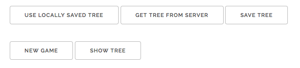
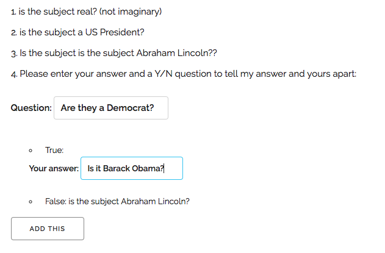
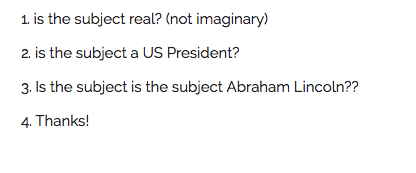

# Twenty Questions with Learning

We're familiar with our 20 questions game, but it's very limited. Ideally,
when it fails, it should augment its tree to learn new questions and
answers.

1. Play the game as usual
1. If the human wins, the game asks:
    1. The correct answer (this will be the "Yes" or "True" child)
    1. A Yes/No (True/False) question to tell the correct answer and the
    incorrect one apart
1. It updates the tree
1. It adds two buttons:
    1. save the tree to local storage and
    1. read a saved tree from local storage

Saving to local storage allows us to keep the augmented tree, even if we
close our browser.

If we save to the cloud, we can have have many people playing the game,
augmenting the tree and building an enormous tree.

## Goals

The main educational goals of this assignment are to

* modify a complex data structure like a tree, and
* get/put data to local storage in the browser

There isn't anything new in terms of JavaScript programming, event
handling, DOM manipulation or much of what we've learned this
semester. However, it is a good opportunity to practice. 

## Tree Growth

Our trees will only grow at the *leaves* (rather like real
trees). That is, a leaf (a guess) will be replaced by an node with a new
question, a new answer (the "yes" child) and the old leaf (the "no"
child).

Let's be very specific. Here's the example from class.

The before representation is like this. We have two global variables that
keep track of where we are in the tree. The system has just asked "Is it
Abraham Lincoln?" which is the current node:

```
:::JavaScript
parentNode = {Q: "Is it a US President",
              Y: "Is it Abraham Lincoln",
              N: ...};
currentNode = "Is it Abraham Lincoln";          
```    

The user says "no", so the computer loses. When that happens, the computer asks:

> What is the correct answer and a question to distinguish
> the correctd answer from my answer?

The user enters "Are they a Democrat?" with the "yes" answer being
"Is it Barack Obama?"

So the computer updates the tree to look like this:

```
:::JavaScript
parentNode = {Q: "Is it a US President",
              Y: {Q: "Is the subject a Democrat?",
                  Y: "Is it Barack Obama?",
                  N: "Is it Abraham Lincoln"}
              N: ...};
```

Note that I've simplified things a little bit by saying that the *new*
question will *necessarily* have the old guess be the "No" child.

However, one thing you *can't* assume is that the old guess is the "Yes"
child of the parent node. That is, the user can replace any leaf in the
tree, both Yes children and No children.

## Parent Nodes

Anytime you are doing surgery on a tree, you will often need the *parent*
node of the current node. That is definitely the case here. So, you will
have to modify your old code to keep track of the parent node as well as
the current node.

## Files

Keep all your existing JS files from A9 unchanged.  You will have to
modify your HTML file to add the new buttons and the new template for
form.  (I used templating and cloning; I think that's much easier than
creating elements using JavaScript.)

Add just a single JS file, called `20-learning.js`. Load this file last,
which will then allow it to re-define any functions from your earlier work
that you need to do.

## Buttons

You'll have to add two buttons to the main page:

* one to save the current tree to local storage, and
* one to get a tree from local storage

Here's a screenshot:

<figure>

<figcaption>Buttons for 20 Questions with Learning</figcaption>
</figure>

You'll also have a new dynamic button (with the handler delegated to the
game container), the "add to tree" button that does the following:

* takes the new question and answer out of the form, and
* modifies the tree, and
* removes the form.

## Tasks

Here are the various tasks you have to do. You can do them in any order,
but the order below makes some sense.

### Augment Tree

Write a generic function to do the tree surgery. It should take an
internal node (the parent of the leaf that will be replaced), the current
node (a leaf, which is a guess), the user's new question, and the user's
new answer. Like this:

```
:::JavaScript
function addToTree(parent, current, userquestion, userans) ...
```

The first argument is an internal node (like we saw above) and the other
three are all strings.

You can test this from the JS console, and you can use the show tree
function from last time to nicely format the modified tree.

### Track the Parent

As you know, you'll have to maintain `parentNode` as well as
`currentNode`. Modify the existing game to keep track of that new value. I
suggest copying the functions that you need to modify into your
`20-learning.js` file and modify the copies to maintain the extra variable.

## Ask the Question

You'll also have to modify the way a losing guess is handled. Instead of
saying "Boo! I lost"; it will have to request the correct answer and a
question. Here's a screenshot:

<figure>
    
    <figcaption>On a loss, ask for the answer and a question</figcaption>
</figure>

### Handle the Modification

Add an event handler to handle the new "Add This" button. The handler will
be delegated to the question container, just like all the others for the
yes/no questions.  This handler will invoke your `addToTree()` function
from above to do the real work. The handler will also remove the question
form. I replaced it with a "thank you" message:

<figure>
    
    <figcaption>After submission, clean up</figcaption>
</figure>

At this point, you should be able to play the learning version of the
game.

### Save/Get the Tree

Next, you need to implement a function to convert the tree to a JSON
string, using `JSON.stringify()` and save the string to local storage, and
another function to read the string from local storage and convert it back
to objects using `JSON.parse()`. 

You can test these functions using the JavaScript console.

### Add the Handlers

Finally, attach those functions as event handlers to the buttons on the
main page.

You're done!

## Hints

I have been using my jQuery [bounds-checking
plugin](http://cs.wellesley.edu/~cs204/lectures/L21/#bounds-checking-plugin),
which we mentioned in class.  It just catches certain kinds of errors.

Let me know if you need any other hints.


## Getting Started

Since this will be based on your static version of the 20 questions game,
you should start by copying your A9 submission to a new folder and making
the new folder and its contents writable:

```
cp -r a9-done a11-work
chmod -R u+w a11-work
```


## Feedback

Please fill out this [form](https://docs.google.com/a/wellesley.edu/forms/d/e/1FAIpQLScFRGKYr_HRjvdujSpC_4cRpecOAZQJvX9_OhAWjb4Eal3CMg/viewform?usp=sf_linkhttps://docs.google.com/a/wellesley.edu/forms/d/e/1FAIpQLScFRGKYr_HRjvdujSpC_4cRpecOAZQJvX9_OhAWjb4Eal3CMg/viewform?usp=sf_link)

That form will help me improve the course for next time. The form is
anonymous; it will not collect your username.

## How to turn this in

Do all your work in a new folder called `a11-work` which you created by
copying your `a09-done` folder, above.

When you are done, rename your working directory to a finished directory:

`mv a11-work a11-done`

then make it not writeable:

`chmod -R a-w a11-done`

Finally, touch the directory for the last time:

`touch a11-done`
