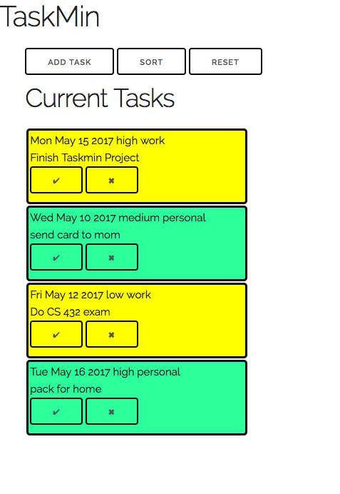
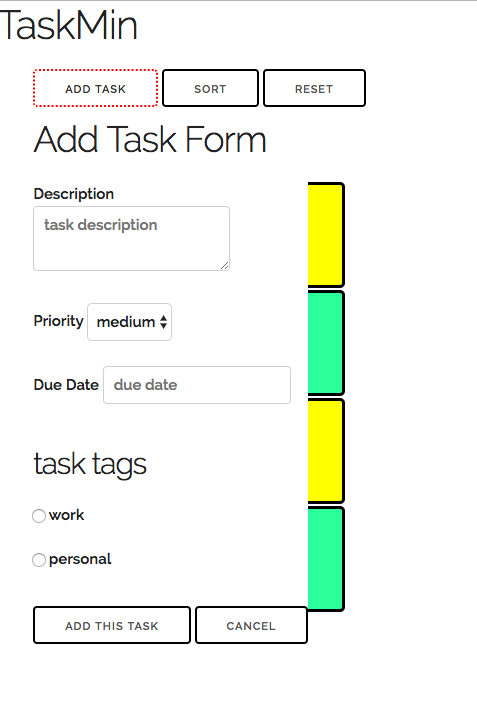
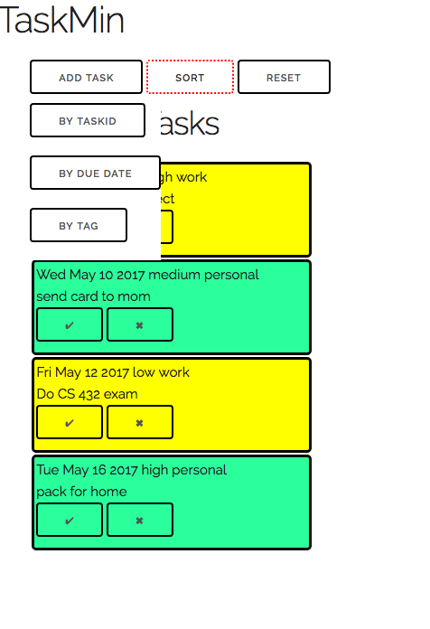
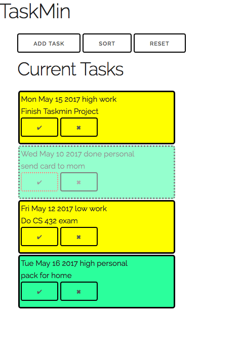
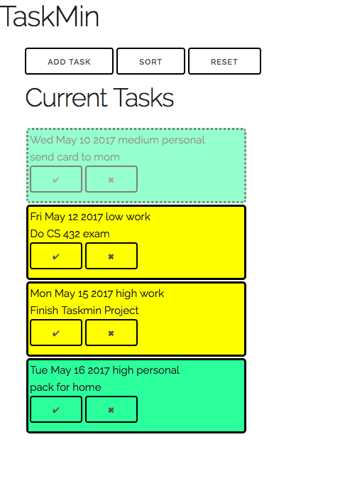
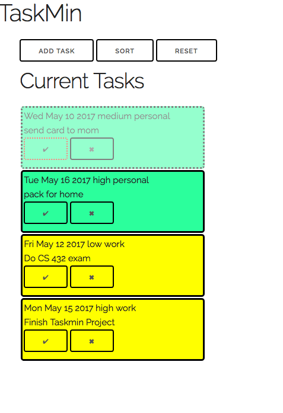
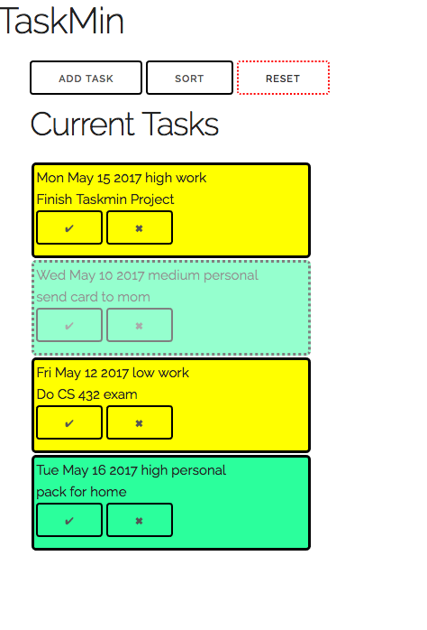
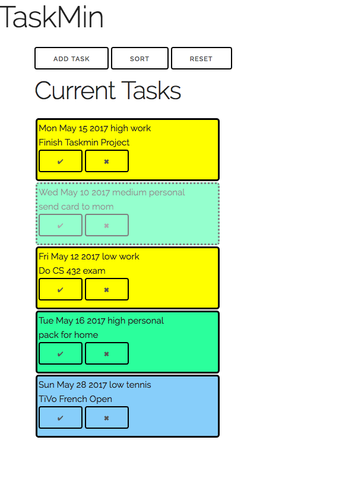
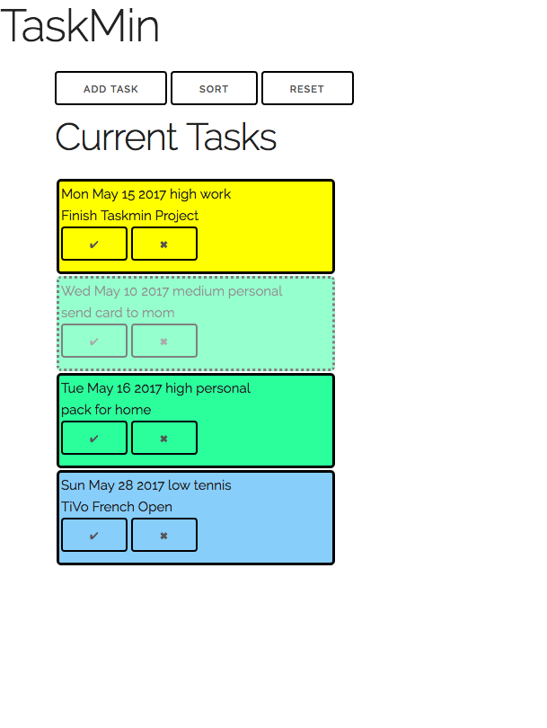
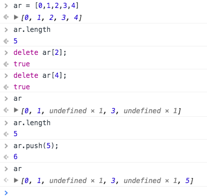

# Task Administration (TaskMin)

For your final project, you will build an application with practical
value, something you can use from your own phone and show to friends and
family.

This practical app will be an electronic task list ("to do" list).  Each
task has the following properties:

1. text, describing the task
1. priority, "high", "medium" (the default) and "low"
1. duedate: a parseable date string
1. tag: one of the possible built-in tags such as "work" or "personal"

The task will also have an `id` which is a unique number to identify the
task. The value is assigned by the `TaskList` object when it's added to
the list. We'll talk more about it later. The `id` will not change, even
if the list is sorted. We'll use it to find the task in the list.


## Goals

The main educational goals of this assignment are to

* maintain a complex data structure (a list of tasks), and
* provide an accessible UI to that list, and
* get/put data to local storage in the browser

## Overall

At the top of the app are several buttons:

1. The first button allows the user to add a task by opening up a form to
enter the properties listed above.
1. The second button allows the user to sort the tasks by index, tag, or
duedate.
1. The third button is a "reset" button that throws away the saved list
and replaces it with some known examples. Useful for debugging.

## Screenshots

<div id="screenshots">
<style scoped>
#screenshots figure {
    display: inline-block;
    box-sizing: border-box;
    width: 31%;
    margin: 1px;
    border: 1px solid green;
    }
</style>    
<figure>

<figcaption>Default with Examples</figcaption>
</figure>
<figure>

<figcaption>Add Task Dropdown</figcaption>
</figure>
<figure>

<figcaption>Sort Dropdown</figcaption>
</figure>
<figure>

<figcaption>Completed Task</figcaption>
</figure>
<figure>

<figcaption>Sort By Due Date</figcaption>
</figure>
<figure>

<figcaption>Sort By Tag</figcaption>
</figure>
<figure>

<figcaption>Sort By Task Id</figcaption>
</figure>
<figure>

<figcaption>After Adding a Task</figcaption>
</figure>
<figure>

<figcaption>After Deleting a Task</figcaption>
</figure>
</div>

## HTML

It would be reasonable to start with the HTML and CSS for the basic page,
including the buttons at the top, the drop-down add-task form, the
drop-down sorting menu and the display of the tasks.  Once you have the
tasks formatted, you can use cloning or other techniques to build the task
items dynamically.

For now, just use two radio buttons for the two example tags ("work" and
"personal").  Eventually, you will make this dynamic, but save that for
last.

Your task display will include a button to let the user mark the task as
done (I used a check mark) and another to delete the task (I used an
X). You can do these glyphs as follows:

```
:::HTML
<button type="button" class="done">&#2714;</button>
<button type="button" class="delete">&#2716;</button>
<button type="button" class="more">&#271A;</button>
```

If you want to do something else with your buttons, that's fine.

## Tags

Your code doesn't have to allow the user to modify the list of possible
tags, but it should be parameterized so that there is a global list of
possible tags, and the developer using your code can add or remove a tag
from the app just by editing that list:

```
:::JavaScript
var tags = ['work', 'personal'];
var defaultTag = 'personal';
```

To format a task, the developer just specifies a CSS rule matching the
name of the tag as a class. Similarly, formatting for completed tasks can
be specified by the developer by customizing the `done` class.

```
:::CSS
.work { background-color: yellow } 
.personal { background-color: #2BFF9C; } 
.tennis { background-color: lightskyblue; }

.done { opacity: 0.5; border-style: dotted; }
```

Note that this means that your code will format a task display partly by
adding a CSS class to the `li` that contains the whole task.  (I used `li`
for accessibility reasons, since assistive browsers will make it easy for
a reader to go from one list item to the next or previous item.)

## Tasks

You'll implement an object to represent a task.  These objects represent a
single task, such as "send card to mom before Mother's Day". The task
object has methods to modify them and format them on the page.  More info
below.

## TaskList

There is a global variable that holds a list of all the task objects and
allows the list to be modified. Any changes to the list are automatically
saved to local storage.  (However defer the automatic saving until you've
gotten the management of the tasklist right, so that you aren't constantly
having to reset the saved tasklist.)

This variable holds the whole list of tasks. The value is an instance of a
class, but we'll only create one instance of the class. Nevertheless,
you'll implement the methods in the usual way.

## Time and Datepicker

You should allow the user to enter the duedate using a jQuery UI
datepicker.

## Files

I suggest one file for each of the classes and one for the app as a
whole. I had the following files:

* `Task.js` to define the `Task` class and its methods. 
* `TaskList.js` to define the `TaskList` class and its methods. 
* `taskmin.js` to define the event handlers and other aspects of the app.

I decided not to have a separate `.css` file this time. You can do that if
you wish.

## Example Tasks

I've provided a file with four example task descriptions, with different
dates, priorities, and tags. Feel free to add more.  Here is the [example
file](example.js).  Here's one of the descriptions:

```
:::JavaScript
        {text: "Finish Taskmin Project",
         priority: "high",
         duedate: "May 15, 2019",
         tag: "work"
        }
```

This is the kind of data that will be saved to localStorage.

## Steps

Here are the various steps you have to do to complete this project. (I
would call them tasks, but that would be confusing in this assignment.)
You can do them in any order, but the order below makes some sense.

## Implement Tasks

Define a constructor and methods for Task objects. The constructor should
take a JS object literal that describes a task, like the example
above. You should have reasonable default values for all instance
variables. The due date should be converted into a date object for sorting
purposes.  The description object will also have a boolean indicating
whether the task is done (completed), which the instance should keep track
of, too.

As described earlier, the task will also have an `id` which is a unique
number to identify the task. The value is assigned by the `TaskList`
object when it's added to the list, so it is not part of the description
that is passed to the constructor.  This id will facilitate administration
of the task, including getting tasks, sorting the list and removing
tasks).  However, the task won't know where it is in the list until it's
put in the list, so the constructor won't be able to do that.

To help with my debugging, I implemented the following method to print a
task succinctly. You're welcome to it. (Note that it uses the new JS
[template
string](https://developer.mozilla.org/en-US/docs/Web/JavaScript/Reference/Template_literals)

```
:::JavaScript
Task.prototype.toString = function () {
    var due = this.duedate ? ' due on ' + this.duedate : '';
    var tags = this.tags.length == 0 ? '' : ' (' + this.tags.join(',') + ')';
    var id = this.taskId;
    return `#<Task ${id} ${this.text} ${due} ${tags}>`;
};
```
I implemented the following simple getter methods:

* `mainTag()`; used in sorting. It returns the first tag in the Task
* `getDuedate()`; also for sorting
* `getId()`; for identification, sorting and other purposes

The following methods are a bit more complex:

`format()` creates a DOM element to display the task on the page. As in the
past, I used cloning for this, but the implementation is up to you. You
should definitely refer to the HTML you drafted earlier, in designing the
page. The method should return a DOM object suitable for adding to the
page, say by the jQuery `.append()` or `.appendTo()` method. The formatted
DOM element should have a class based on its tag and, optionally, the
`done` tag if it's a completed task. It should have a `data-taskId`
attribute giving the taskId, which we'll need for button handling.

`markDone(domElement)` records that the task is done and updates the DOM
element to show that. In particular, for accessiblity, this will be marked
textually by replacing the display of the priority to the word
`done`. Furthermore, in the screenshots above, there is a style change
including a dotted border and reduced opacity. You can leave this
configurable by the user by just adding the `done` class to the
element. This would allow the user to change the effect by modifying the
CSS rule, without knowing any JavaScript. Of course, you should implement
a default behavior, namely the dotted border and reduced opacity.
Finally, the `markDone` method should make the task list save the changes.

## TaskList

The tasklist has a few jobs: it holds the list (array) of task objects, it
allows them to be sorted, it allows them to be removed, and it makes sure
that changes to the tasks are saved to localstorage. (The app makes this
automatic; the user doesn't have to remember to save changes.)

I decided to implement this as two classes, a superclass that defines a
*persistent list*; persistent because it is saved to local storage. Then
the subclass is a list of tasks, including custom sorting methods and
such.  You don't have to do this. (I did it because a more featureful
version of the app had lists of tags, which were also persistent.)

The constructor should have one argument: the *key* that the data should
be stored under in `localStorage`. The key is, of course, a string, such
as "taskmin-data" or "taskmin-tasklist" or something like that; your
choice.

```
:::JavaScript
localStorage.setItem(key, JSON.stringify(...));
```

The instance should remember the key in an instance variable, so that the
TaskList object will always be able to save.

The object will also have an instance variable that is the list of tasks.

Here are the methods you should have:

* `save()` which saves the list to `localStorage` using `JSON.stringify` on the list of tasks. 
* `read()` which reads the list from `localStorage` using `JSON.parse` to turn it into JavaScript objects. If that
   value is null, it uses the `example_task_list` that we saw earlier. These *won't* be Task objects, but
   descriptions, so you should save them in a different instance variable, to be used by the `makeInstances`
   method, below.
* `clear()` which sets the localStorage to null, as well as setting the list to null.

The last method is really helpful in debugging, because using local
storage means that *even reloading the page doesn't reset your app*. If a
bug causes save bogus stuff to be saved in local storage, you need to have
a way to clear it out.

More methods:

* `get(taskid)` which takes a taskId, searches the list and returns the task with that id.
* `push` which adds a new task object onto the end of the list. It sets
  the id of the task as well, using the length of the list, and saves the
  changed list.

Next, define a method named `makeInstances` to convert a list of task
descriptions into real `Task` objects. It should get the list of
descriptions from the instance variable that was set be the `read`
method. It uses the `Task` constructor to make an object and the, uses its
own `push` method to add the task object to its internal list.  The `push`
method, as a side effect, will set the id of the task).

Note that, for reasons we'll understand more when we talk about deleting
tasks, there may be elements that are *missing*. That is, the array
element's value is `undefined`, a special JavaScript value. You'll have to
skip these missing elements. Fortunately, the undefined value counts as
false (technically, "falsey") and stringfies to `null` (which is also
"falsy") so you can use a simple `if` statement to skip these missing
elements:

```
:::JavaScript
    for( var i in descs ) {
        var desc = descs[i];
        if( desc ) {
            // handle a real element
        }
    };
```

## Formatting

Define a method that iterates over the list of task objects and formats
each of them and adds them to the document.  This will be complex, but
we've done methods like this before.  Your method will have to:

* create a container list of task DOM elements
* iterate over the list of tasks
    * for each one, format it (using the task's `format` method), 
    * append it to the container
* finally, empty the container's parent and append the newly formatted DOM elements

## Deleting

We need to be able to remove a task from the list (maybe it's a mistake,
or we've given up on the task). We'll do this by using a special `delete`
operator in the JavaScript language that will replace an array element
with `undefined` which causes it to be skipped by things like the `sort`
method.  You can read more about the [delete
operator](https://developer.mozilla.org/en-US/docs/Web/JavaScript/Reference/Operators/delete)
on the MDN site.  Here's a simple example (try this in a JS console):

```
:::JavaScript
var ar = [0, 1, 2, 3, 4];
ar.length;
delete ar[2];
delete ar[4];
ar.length;
ar.push(5);
ar;
```

Here's a screenshot:
<figure>

<figcaption>The delete operator</figcaption>
</figure>

Deleting an element leaves a "hole" in the array. If we iterate in the
old-fashioned way, we'll land on the holes and have a problem:

```
:::JavaScript
for( i = 0; i < ar.length; i++ ) {
   console.log(i,ar[i]);
}
0 0
1 1
2 undefined
3 3
4 undefined
5 5 
```

Instead, you can iterate either using a variant of the `for` loop that
iterates over the properties of an object (indexes of an array):

```
:::JavaScript
for( i in ar ) {
   console.log(i,ar[i]);
}
0 0
1 1
3 3
5 5 
```

Or use the .forEach method on an array:

```
:::JavaScript
ar.forEach( function(i,e) { console.log(i,e); });
0 0
1 1
3 3
5 5 
```

## Removing a Task

To remove a task, your method should take a taskId as an argument, just
like the `get` method, iterate over the array of tasks (also just like
`get`), and when it finds the task, delete it from the array just using
the `delete` operator.  It should then save the changed array to local
storage.

We'll keep the holes in the array, and iterate over the array using the
techniques we were reminded of in the last section.

Note that this method won't remove the DOM element. We'll take care of
that later, in the UI.

## Sorting

Define a method `setSortKey` which sets the sort key to one of the
possible values: 'taskId', 'dueDate' and 'tag'

Next, is the `sort` method itself.  This method will be difficult and
complicated, since you have to be able to sort the tasks in three
different orders. Fortunately, you can put this method off while you work
on adding tasks and other stuff.  Here's what the method needs to do:

* Decide which sorting code will be used, based on the sortkey.
* In each case, you'll use the built-in
  [`sort`](https://developer.mozilla.org/en-US/docs/Web/JavaScript/Reference/Global_Objects/Array/sort)
  method on the internal array of tasks, passing in an appropriate
  comparator function.
    * Sorting by tagId is straightforward, since those are integers. Just subtract.
    * Sorting by date is also straightforward, since you can subtract date objects (returning the time difference)
    * Sorting by strings is easier if you know about [localeCompare](https://developer.mozilla.org/en-US/docs/Web/JavaScript/Reference/Global_Objects/String/localeCompare)

## Debugging

I'll provide you a method to show the contents of a TaskList and a
function that will help you in understanding these methods and in testing
them. They are in the file [testing.js](testing.js)

At this point, you've implemented the two main classes, and you only have
the initialization and UI to do.  

## Main JS file

So, we turn now to our main JavaScript file, `taskmin.js`

First, create an instance of the `TaskList` class and put it in a global
variable name `theTaskList` to store all our tasks. Next, define a list of
tags. For example:

```
:::JavaScript
var tags = ['work', 'personal','tennis'];
var defaultTag = 'personal';
```

Next, we have to define a function to process that
list of tags to create the radio buttons in our "add task" form.  If you'd
like to use your hard-coded radio buttons and put off this part of the
implementation until later, that's fine.

We'll name our function `addTagsToAddTaskForm`. It takes no arguments, but
will make use of the global we just defined.  The function does the following:

* creates an empty container (`ul`) for the radio buttons
* iterates over the list of tags, and for each
    * creates a DOM element
    * appends it to the container
* appends the container to the DOM in an appropriate place

## UI for Adding a Task

Define a function named `addTask` to add at Task to the page. This
function is invoked after the user has filled out the form and clicks the
"add task" button.  Here's what the function does:

* creates an empty JS literal for the task description
* copies the user's values out of the form and into the description
* clears the form
* constructs a Task object
* pushes the Task object onto the task list
* sorts the task list (so that the task goes into the right place given the current sort order).

Note that the DOM has a built-in method to reset a form, and jQuery
doesn't wrap that up, so we need to get the real DOM element and use the
built-in method. You can get the real DOM element by indexing into the
array returned by jQuery. So the following will do the trick:

```
:::JavaScript
$("expression to find the form")[0].reset();
```

## Button Handlers

Add a click handler to the `addTask` button at the end of the form that invokes `addTask` and then hides the form.

Add a click handler to the `cancel`  button at the end of the form that clears and hides the form.

Make sure the form is hidden when the page loads.  Add the handlers that
will allow the user to show and hide the form and add those to the main
"ADD TASK" button.

I used jQuery's `slideUp` and `slideDown` animations.

## Task Buttons

Use event delegation to handle buttons on all the tasks. Each task will
have two buttons ("done" and "delete") and who knows how many tasks you
will have.

The handler for the "done" events does the following:

* finds the DOM element that contains the whole task
* reads the task's ID off the DOM element (it's stored in a `data-taskId`
  attribute, as you know from the `format` method`)
* gets the task object out of the task list
* marks the task as done.

The handler for the "delete" events is similar. It does the following:

* finds the DOM element that contains the whole task
* reads the task's ID off the DOM element (it's stored in a `data-taskId`
  attribute, as you know from the `format` method`)
* removes the task object from the task list
* removes the DOM element from the document

Because the first two steps of those event handlers do similar things, I
defined functions to do them:

The `getTaskElt` function takes an event target (which will be one of the
buttons) and looks up the tree (using the jQuery `closest` method) until
it finds the task element (the one surrounding the whole thing). My task
elements were formatted with a `task` class, so I just searched for that.

The `getTaskId` function takes a task element &mdash; a jQuery object
corresponding to the task DOM element. In other words, it takes the kind
of thing that `getTaskElt` returns.  It pulls the `data-attr` value off
the element, and uses `parseInt` to convert it to an integer. It returns
it.

## Sorting UI

There are a bunch of buttons related to sorting that we are now ready to
do:

* the main "SORT" button should show/hide the sort menu as
  appropriate. Initially it is hidden, of course.

Each sorting buttons does similar things, so we first define a function
`resortBy` that takes a sort key as its only argument. The sort key is a
string, one of "taskId", "dueDate" or "tag".  The function does the
following:

* set the sort key for the task list to the given value
* sort the task list
* format the task list, and
* hide the sort menu

You can test `resortBy` in the JS console!

So, the three sorting buttons should be given handlers that invoke
`resortBy` with the appropriate argument.

## Almost there

Finally, I defined a function to initialize everything. It invoked the
`addTagsToAddTaskForm` function. It also initializes the task list, by
doing the following:

* read the descriptions from local storage
* make the instances
* format them 

Make sure that function is invoked when the page loads, after everything
is loaded. I put its invocation into the main HTML page in a `script` tag
just for it and the initialization of the datepicker.

To make debugging easier, I defined a handler for the "reset" button that
clears the task list and reinitializes everything (invoking the previous
function). If you need to reset things, it's easy to do so.  Add that to
the "reset" button.

You're done!

## Rubric

Here's how you will be graded (10 points for each item):

Functionality:

<ol start="1">
<li>Displays all tasks on the tasklist</li>
<li>Allows tasks to be marked "done" and updates the UI appropriately</li>
<li>Allows tasks to be deleted and removes them from the UI</li>
<li>Allows tasks to be added using a form</li>
<li>Allows tasks to be sorted in a variety of ways, using a menu</li>
<li>Changes to the tasklist and tasks are saved to local storage</li>
<li>Testing functions work correctly</li>
</ol>

Coding and Accessibility:

<ol start="8">
<li>Event Handlers for task operations ("done" and "delete") are delegated.</li>
<li>Coding is clear, with good style, modularity and documentation</li>
<li>App is mobile-friendly and accessible: the app can be displayed on a small
device, can be operated with a keyboard or a touch screen)</li>
</ol>

Note that many of the above points can be addressed separately: once you
can display the example tasks, all of the functionality items can be
implemented independently. If you get stuck on one; try another. There's
plenty of partial credit available for partial implementations.

## Chaining

You'll notice in my testing function, I used method chaining, like this:

```
:::JavaScript
tl.read().makeInstances();
```

If you didn't implement that, you can just re-write the function to eschew
chaining:

```
:::JavaScript
tl.read();
tl.makeInstances();
```

If you want to do chaining, it's easy enough. Just make sure that each
method that you want to be chainable returns the object. For example, the
`read()` method above returns the same object that the `makeInstances()`
method will need.

## Hints

I have been using my jQuery [bounds-checking
plugin](http://cs.wellesley.edu/~cs204/lectures/L21/#bounds-checking-plugin),
which we mentioned in class.  It just catches certain kinds of errors.

There is no rubric reward for the reset button, but even though this
functionality is described last, you should implement it early, or at
least simultaneously with working with local storage. Otherwise, you will
have a difficult time when buggy data structures are saved to your
browser. (That's what happened to me, and that's why I implemented the
reset button.)

You do not need to hide all this code in an IIFE. That makes debugging
harder, so it's useful to omit it. In a professional project, we would use
the modularity techniques we've learned, but we would probably put off
doing so until the implementation was working.

Don't let the UI get in the way of making progress. If you're having
trouble with the drop-down effect for add-task and sorting, leave them
open while you work on the add-task and sorting functionality.

The drop-downs happen on click, not on hover, since hover isn't mobile-friendly.

Let me know if you need any other hints.

## Stuff You Don't Have To Do

### Confirmation

In a more advanced app, we should allow the user to *undo* operations or
require them to *confirm* destructive operations.  In this app, though,
you need not do that. 

## Feedback

Please fill out this [form](https://docs.google.com/a/wellesley.edu/forms/d/e/1FAIpQLScVl9g4riZuVTOeMoBGzh4Gh-mUzRG-sKlycYhuVXs6ThdHmQ/viewform?usp=sf_link)

That form will help me improve the course for next time. The form is
anonymous; it will not collect your username.

## How to turn this in

Do all your work in a new folder called `taskmin-work`.

When you are done, rename your working directory to a finished directory:

`mv taskmin-work taskmin-done`

then make it not writeable:

`chmod -R a-w taskmin-done`

Finally, touch the directory for the last time:

`touch taskmin-done`
