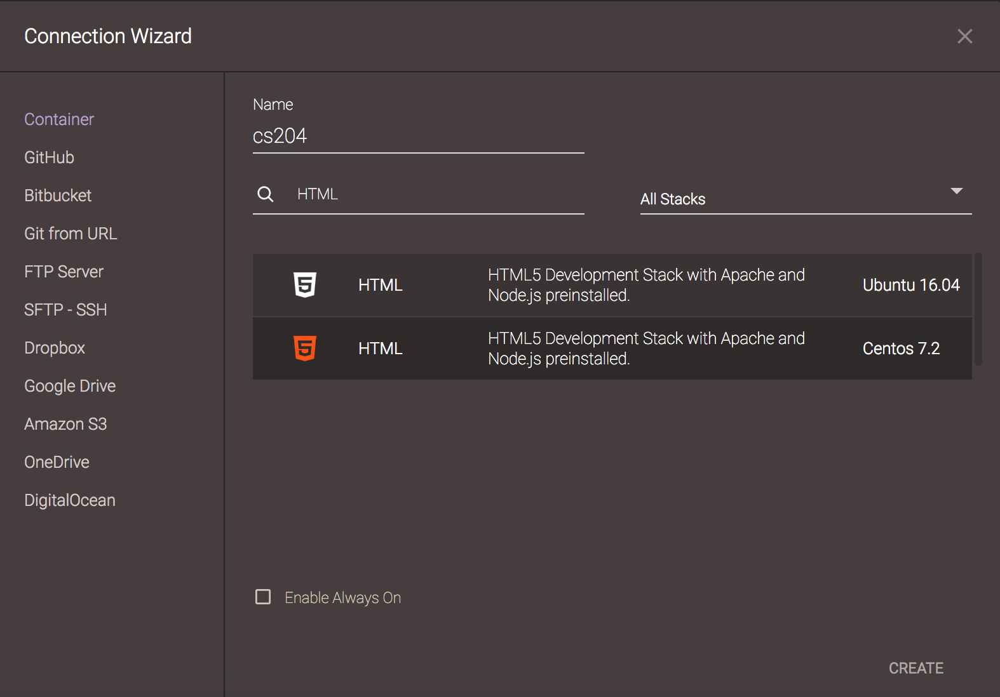
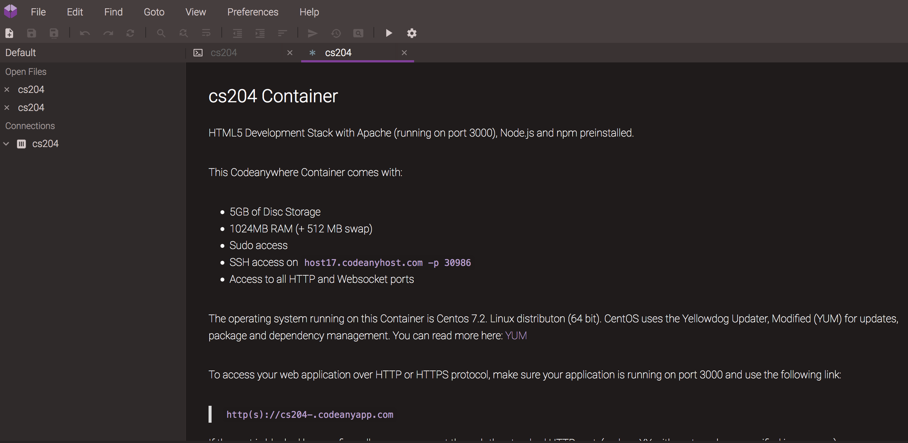
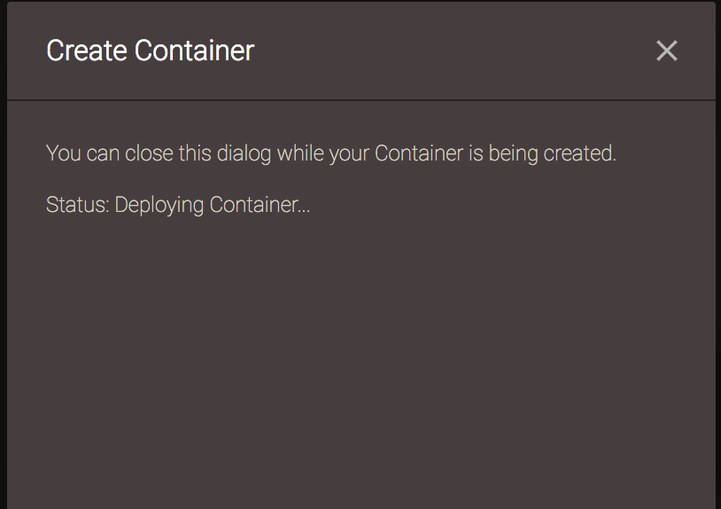
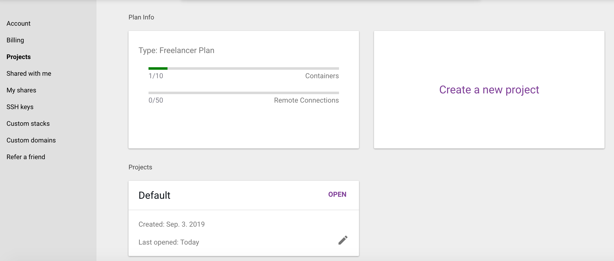
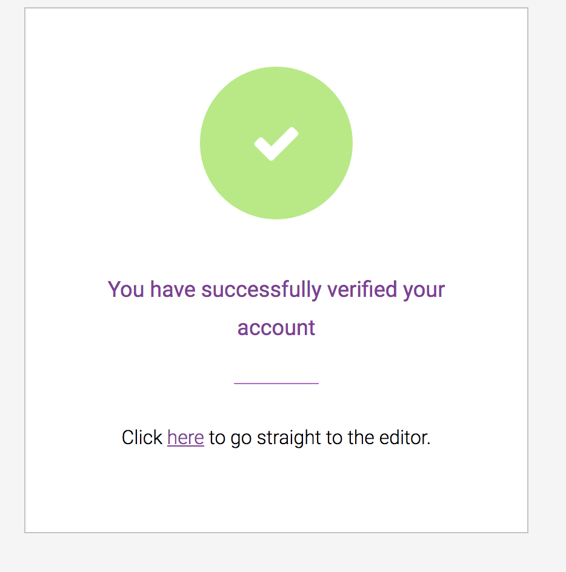

<!--- [TOC] --->

# Environment, HTML and URLs

This is our first class, so we'll talk about the course, call roll, and
then get started setting up our environment and getting under way.

## About this Course

The history is told on the [about page](../../about.html). In a nutshell:

* Prereq is CS 111. CS 115 is not sufficient.
* I expect that you know programming basics:
    * variables and scope
    * conditionals
    * loops
    * functions
    * methods
    * arrays and dictionaries (Python) or arrays and objects (JavaScript)
* I do *not* expect that you know much HTML or CSS. It always helps if you do, of course.
* The plan is for this course to be offered every semester next year, and
probably ongoing
    
## Target Audience

Intended to be a class for *beginners* in either CS or MAS, with just one
prior course.

Similar to CS 230 rather than CS 304.

So, one difficulty is the range of skill and experience in the class.

* the course may be boring for some and challenging for others
* I hope to avoid it being too boring and too challenging.
* my aim is to aim for the lower end, so boring is more likely
* you have been warned. :-)

## About the Course

Web Applications have a front-end and a back-end. The front-end is
everything that happens in the browser.  In general, sticking just to the
front-end is not much of a limitation. Many powerful applications are
*mostly* front-end, except for long-term storage of data:

* FaceBook
* Gmail
* Google Docs

We will learn:

* HTML *structure*
* CSS  *appearance*
* JavaScript *behavior*
* the DOM, which is how JavaScript controls the page, including HTML, CSS
and event handling
* jQuery, a JavaScript library for doing common DOM-related operations

## Waiting list

* If you're on the waiting list, write your name and year (e.g. '19) down
* send me email if there are special circumstances that I should know, such as
    * This could be the *only* CS class you'll have this semester
    * You'll be abroad all next year
    * something else
* I can't promise anything, but I will do my best    

## Roll Call

During add/drop, I'll call roll. It also helps me learn your names and
faces. Please correct my pronunciation of your name if necessary, and
please tell me what your pronouns are. I use "he/him".

I will probably do additional "getting to know you" exercises. Bear with me.

## Syllabus issues:

* Communication: please read/use email every day. I'm old; it's what I use
* Sakai for quizzes and for distributing grades
* [syllabus](../../syllabus.html)
* [schedule](../../schedule/schedule.html)

We'll take a few minutes now to talk about the syllabus and the schedule.

## Environment

Code Anywhere is a platform where you get your own virtual machine in the
Cloud, paid for by me and the department.

* command line 
* files and folders
* built-in editor
* variety of backend servers; we'll use the default, which is Apache
* uniform development environment, whether you're a Mac, PC or Linux person
* 1 container that ...
* you will share with me and with the tutor, and various partners

## Demo

I'll show you around a little. Then we'll dive in a bit.

## Orientation

We'll look around at the various parts of the CA interface

## Account setup

1. Click on the email that was sent to you
1. confirm the account and set a password
1. Login and go to your dashboard
1. send a confirmation email to yourself.
1. when the confirmation email arrives, confirm it
1. then, you should be able to go to the "editor" and create a container

Some pictures you might see corresponding to these steps:

<div>
<style scoped>
img { max-width: 100%; width: 45%;}
</style>





</div>

## Container Creation

A container is a virtual computer, hosted on another computer. 

1. Create a container with File / New / Container
1. I suggest calling it "cs204"
1. search for a PHP stack
1. click on the "CentOS 7.2" option
1. wait while the machine is created (deployed)

## The User Interface

It has:

* Menus on the top like a desktop Integrated Development Environment (IDE)
  application. That will all you to create, edit, and save files,
* files and folders on the left hand side
* windows (panes) on the right

## Using a Workspace

1. create a new file
1. save it as hello.html
1. copy-paste the following code into it:

```
<!doctype html>
<html lang='en'>
<head>
    <meta charset='utf-8'>
    <link rel='stylesheet' href='style.css'>
    <title></title>
</head>
<body>

<h1>This is an H1</h1>

<p>This is a very boring paragraph.</p>

</body>
</html>
```

1. Open the hello.html file by right-clicking (control-click on a mac) and
choosing "preview"
1. This will open up a new tab with your html page in it!
1. Change something, save, and switch to the other tab. shift-refresh to
see the changes.
1. have fun!

## Sharing

I can see exactly what you see if you share your workspace with me. (No
copying files around.)  In fact, you *must* share your workspace with me
and with the tutors in order for us to grade your work. Be sure to do the
following:

* control-click on the container (cs204) and click "share"
* share it with my email address `scott.anderson@wellesley.edu` 
* the default is to share the workspace `edit`

## More stuff To Do

save copies of the file to `fred.html` and `george.html`

in `fred.html`, put in a link to `george.html`:

```
<a href="george.html">Go to George</a>
```

in `george.html`, put in a link to `fred.html`:

```
<a href="/fred.html">Go to Fred</a>
```

One has a slash and the other doesn't. That's on purpose.

Save the result and try it. 

Do both links work? 

## Relative URLs

Both links should work.

Now, we're going to move this stuff out of our way, for some other day

1. Close the editor panes you have open to these files
1. right click on the container and click on SSH terminal. A new pane opens.
1. type `ls`
1. type `ls -l` for more info
1. type `mkdir hello`
1. type `mv *.html hello` and `mv *.css hello`
1. type `ls` to see what happened (and look in the file browser)
1. type `cd hello` to go to that folder 
1. type `ls` to see the files
1. right click on the container and click on "refresh"

Now, we'll look at the new location:

1. open the `hello` folder in the file browser
1. open `fred.html` 
1. preview it
1. notice that the URL now has `/hello/` spliced in
1. try the links. Do they work?

## URLs

URLs are used within websites and web applications to connect pieces
together, including
* supporting files (CSS, JavaScript),
* images, and
* links to other web pages

There are two main kinds:

* Absolute URLs work from anywhere
* Relative URLs work when starting from current page

Examples of Absolute URLs:

* `https://www.wellesley.edu/cs/curriculum` includes protocol, domain and path
* `//www.wellesley.edu/cs/curriculum` uses default protocol (same as referencing page)
* `/cs/curriculum` uses default protocol and domain

Examples of Relative URLs:

* `curriculum` is a sibling of current page
* `cs/curriculum` is a child of a sibling
* `..` is a parent folder, but you'd never do that in practice
* `../mas` is a sibling of a parent

Here's what a site might look like:


Here's the example we just did:


The reason that `george.html` worked and `/fred.html` didn't work is that
the latter is an absolute URL, so that when we moved the files, the
absolute URL was no longer correct, but the relative one was *still correct*.

In general, use relative URLs for related parts of a project (files that will move *together*)

[Learn more about
URLs](https://developer.mozilla.org/en-US/docs/Learn/Common_questions/What_is_a_URL)

## Share your workspace with me!

Create one container. Call it `cs204`

* use it for all your work. You can share it with your partner, on an
  assignment, and revoke that sharing later. No one else will be able to
  look at it, so your work is secure (you don't want other students
  cheating off you -- unlikely but possible)

But, please *share* your workspace with me and with our tutor. 

* `scott.anderson@wellesley.edu`
* `sxu5@wellesley.edu`

## About our book

* They use Atom and Node for local development and preview. We aren't.
* You can install them on your own laptop if you want; no support
* After the first two chapters, it won't make any difference
* We'll start with chapter 2
* see [FEWD chapter 2](../../LocalOnly/FEWD-Chapter-2.pdf)

## To Do

* fill out the "getting to know you Google Form"
* send me an introductory email
* plan to visit me in office hours sometime
* get a copy of the book. Read chapter 2 and our online supplement for
next time
* There will be a quiz on the reading
