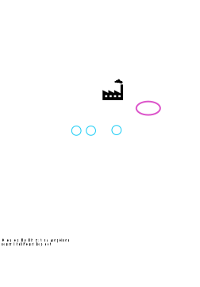

# OOP in JS + Forms

Today, we'll focus on how to do Object-Oriented Programming (OOP) in
JavaScript.

## Plan

1. Discuss Modules in JS
1. Discuss OOP in JS
1. Discuss forms
1. Chapter 8 activity

## The App module from Chapter 8 

You'll find this example on page 171. It has an odd trick in it.

```
:::JavaScript
(function (win) {
   'use strict';
   var App = win.App || {};

   function DataStore () {
      console.log('running the DataStore function');
   }

   App.DataStore = DataStore;  // put it in our app

   win.App = App;   // store app globally
})(window);
```

How does the last line store the App globally?

* `win`, the argument on the first line, is a *local* variable
* `App` on the third line is a *local* variable
* The function on line 5 is a *local* variable
* The assignment on line 9 puts a local value into an attribute of a local value
* The assignment on line 11 puts a local value into an attribute of another local value

Nothing in there assigns to a global variable. So, how can that happen?

Copy/paste that code into a JS console and try it out!

## OOP in JS

Now, we'll switch to talking about OOP in JS.

* First, we'll see a practical example, to help make things concrete.
* Then we'll talk about some abstract principles

## Example of OOP in JS 

Let's see an example using JS, namely bank accounts. Each has

* state: the current balance for that account, and
* behavior (methods): the way that clients can change the balance, namely `deposit` and `withdrawal`

<script id="bank1">
function Account(init) {
    this.balance = init;
}

Account.prototype.deposit = function (amount) {
    this.balance += amount;
};

Account.prototype.withdrawal = function (amount) {
    if( this.balance >= amount ) {
        this.balance -= amount;
    } else {
        throw new Error("Sorry, you are overdrawn");
    }
};

var harry = new Account(1000);
var ron = new Account(2);
</script>

<pre id="bank1-src"></pre>
<script>$("#bank1-src").text($("#bank1").text());</script>

Let's try it out in the JS console!  Try some deposits and withdrawals. If you look in the console, you can see the current balance.

How could we write a method to find out the current balance?

## OOP in JS

What we saw above:

### Constructors

This is the 
* Create a constructor function (really, it's an initializer)
* By convention, name it with a capital letter
* It can access `this` when the constructor is running
* use the `new` keyword when invoking the constructor
* The value of `this` is an new, empty, object
* except the object has a *prototype* connection
* The constructor has no return value
* Commonly, it's used to *initialize* the *instance variables*

We can think of this function as a *factory*, but in practice we name
it with the things it makes. So, we don't call it `makeAccount`; we
called it `Account` because we'll use it like this:

```
:::JavaScript
var hermione = new Account(200);
```

### Instance Variables

In our bank account example, this is the `balance` property.

* also called
    * attributes
    * data members
    * fields
* are properties of the object (`this`)
* can be modified like any object property

As an aside:

* ideally, should not be used outside the object, but
* JavaScript doesn't have that abstraction barrier, though
* if every object were a closure, it would

### Prototypes

Instead of a *class*, like in Java or Python, JavaScript has *prototypes*.

A prototype is an object, just like the one that the factory is
creating, but *all* the objects made by that factory contain an
invisible link to the prototype.

<figure>

<figcaption>Object factory with cyan objects and a pink prototype</figcaption>
</figure>

The prototype has *read-only* properties that *all* instances share. Let's try the following:

```
ron   // one instance variable
ron.__proto__  // a hidden property
Account.prototype;   // an object
ron.__proto__ == Account.prototype;  // the same object
Account.prototype.FDIC = true;
console.log(ron.FDIC);
console.log(harry.FDIC);
```

### Methods

In our bank account example, these were `deposit` and `withdrawal`

* also called
    * member functions
    * instance methods
* functions that are stored in `Foo.prototype`
* inherited by all objects created using the given constructor
* the function is *shared* by all instances (saving memory)
* can reference `this` to refer to the object and its properties
* note that because we assign them to properties of the prototype, the statement ends with a semi-Colon.

### Invoking a Method

We all know how function arguments get their input values: by sequential order:

```
:::JavaScript
function foo(x,y) { return x-y; }

foo(3,2);  // does this return 1 or -1?
```

Methods have another, extra, input value, namely the object. Here's an example:

```
:::JavaScript
function Foo(z) {
    this.z = z;
}

Foo.prototype.sum = function (x,y) { return this.z+x+y; };

var f1 = new Foo(1);
f1.sum(2,3);   // returns 6
```

The syntactic rule is that the special variable `this` gets bound to the object.


## Questions

We'll look at [your questions](../../quizzes/quiz11.html)

## Exercise 1

1. Create a web page in your C9 public account with an attached JS file.
1. Copy the code above into the `.js` file
1. Make sure it works as above
1. If you get stuck, you can use this tarfile: http://cs.wellesley.edu/~cs204/downloads/oop1.tar
1. Add an instance variable to the object for different types of accounts: checking vs savings

<div class="solution">
<pre>
function Account(type,init) {
    this.type = type;
    this.balance = init;
}
</pre>
</div>

## Exercise 2

Write code to add a method that will add `x` percent interest to a savings
accounts but not to checking accounts. Name it `addInterest`.

<div class="solution">
<pre>
Account.prototype.addInterest =
    function (rate) {
        if( this.type == "savings" ) {
            this.balance += rate * this.balance;
        }
    };
</pre>

<p>Did you rename the "x" parameter? Why or why not?
</div>


## Pitfall of `this`

Open up a JS console and try the following:

```
var fred = Account(500);
```

Print the value of `fred`. Print the value of `balance`

What happened?

<div class="solution">
<p>The <code>fred</code> variable is undefined and <code>balance</code> is
a new global variable.

<p>The cause is that we forgot the <code>new</code> keyword.

<p>It turns out that <code>this</code> is equivalent
to <code>window</code> and <q>global</q> variables are properties of the
<code>window</code> object in JS (in a browser). If you want to protect
against this error, make your constructor like this:
<pre>
function Account(init) {
    if( this === window ) {
        throw new Error("you forgot the 'new' keyword");
    }
    this.balance = init;
}
</pre>

</div>

## Invoking methods without an Object

Here's a mistake you're unlikely to make until the situation becomes more complicated:

```
:::JavaScript
var luna = new Account(20);
var balance = 10;
luna.deposit(10);
luna;
var f = luna.deposit;
f(10);
luna;
balance;
```

In the last function invocation, it *seems* like the same function is being invoked and it *is*, but this time the syntactic pattern isn't one of method invocation, so `this` isn't bound to the object (how could it be?) but instead is bound to `window`

When we want to use methods as event handlers, this will become an issue. One solution is a *closure*, but because `this` is special, we can't close over it. 

## More on `this`

The `this` variable is constantly being re-bound. If a function is invoked in the non-method way, `this` doesn't have the value we expect. Here's an example you might find surprising:

```
:::JavaScript
function Foo(x) { this.x = x; }
Foo.prototype.zark = function (y) {
    console.log(y);
    console.log(this.x);
	var f = function () {
	    console.log(y);
	    console.log(this.x);
		};
	f();
	console.log("done");
};

var f1 = new Foo(1);
f1.zark(2);
```

## Solving the `this` problem

So, how to solve the problem above?  In a future meeting, we'll discuss two approaches:

* closures, usually over the word `that`
* the `bind` method that has been added to JavaScript

Meanwhile, let's turn to other topics.

## Using Objects as a Database

There are many kinds of database. A very common and useful type is a [key-value database](https://en.wikipedia.org/wiki/Key-value_database).

For an in-memory database of that kind, we could use JavaScript objects. Like this:

```
:::JavaScript
house['cho'] = 'ravenclaw';
house['draco'] = 'slytherin';
house['cedric'] = 'hufflepuff';
console.log(house['cho']);
```

Or this:
```
:::JavaScript
var heads = {};
heads['gryffindor'] = 'McGonnigal';
heads['slytherin'] = 'Snape';
```

## APIs

Abstraction barriers gives the implementation *freedom*
and *flexibility*. I'll draw a picture of this on the board and if it
works, I'll add it to the reading.

In this chapter we want a key-value database and we decided to use
objects, but what if we wanted to change our minds? What if we wanted
to switch to Oracle NoSQL or LMDB or ... The code above would be a
nightmare to update. But if we hide the database behind an abstraction
barrier, we can isolate that implementation decision and allow
ourselves to change it.

```
:::JavaScript
function KeyValue() {
    this.db = {};
}

KeyValue.put = function (key,val) { db[key] = val; }
KeyValue.get = function (key) { return this.db[key]; }

var heads = new KeyValue();
heads.put('gryffindor', 'McGonnigal');
heads.put('slytherin','Snape');
```

## Chapter 8 Activity

Work through the first part of the activity, but *stop* when you get to page 183 on *debugging*.

Depending on the time we have, either I will step through that with you, or we'll turn to other things.

## List of Accounts

How could we keep a global list of accounts?  Implement that.

<div class="solution">
<p>Here's one way:
<pre>
var allAccounts = [];

function Account(type,balance) {
   this.type = type;
   this.balance = balance;
   allAccounts.push(this);
}
</pre>
</div>

## Printing

Is there a `.toString()` method? What does it do?

Define a `toString()` method for an account. Print all the accounts.

<div class="solution">
<p>Here's one way:
<pre>
Account.prototype.toString = function () { return "Account("+this.type+","+this.balance+")"; };

allAccounts.forEach(function (acct) { console.log(acct.toString()); });
</pre>
</div>

## Processing Accounts

Define a function to add interest to all the savings accounts.

<div class="solution">
<p>Here's one way:
<pre>
function addInterest(rate) {
    allAccounts.forEach(function (acct) { acct.addInterest(rate); });
}
</pre>
</div>

## Chaining

If we have time, let's look at chaining.  Imagine that we have a series of
transactions we need to do. (Maybe these should be changes to house points).

```
:::JavaScript
var hermione = new Account("savings",300);
hermione.deposit(100);
hermione.deposit(200);
hermione.withdrawal(150);
hermione.addInterest(0.1);
```

Fine, but a little tedious. Wouldn't it be nice to chain them together, like this:

```
:::JavaScript
var hermione = new Account("savings",300);
hermione.deposit(100)
        .deposit(200)
        .withdrawal(150)
        .addInterest(0.1);
```

How could we implement that?

<div class="solution">
<p>Make sure each method returns <code>this</code>.</p>
</div>

## Conclusion

Objects often don't seem worthwhile, but taking the time to implement an
abstraction layer often pays off in unforeseen ways.

There was a story I heard where an AI system didn't get an innovation
implemented because they couldn't tell the difference between accessing
the first element of a list as a field accessor (method) versus other
kinds of list processing.

## Chapter 8 code

We'll look at the code that we constructed in Chapter 8
