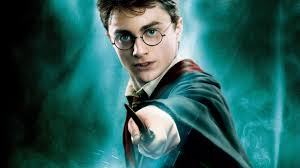

# Objects 

<script src="bank/Account.js"></script>

## Plan

1. Describe and demo assignment 5
1. Keyboard event handlers
1. jQuery animations
1. Quiz questions on bind
1. Discuss bind
1. Discuss midterm

## Assignment 5 (Sliding Tiles)

[Sliding Tiles](../../assignments/a05/tile_game.html)

I'll also demo this.

## Keyboard Event Handlers

This is from chapter 7, which we skipped. 

```
:::JavaScript
document.addEventListener(
  'keypress',
  function (eventObj) {
    
    var a_key = 97; //left
    var s_key = 115; //down
    var d_key = 100; //right
    var w_key = 119; //up
    
    if( eventObj.keyCode === a_key ) {
        console.log("a key pressed");
    } else if(eventObj.keyCode === d_key ) {
        console.log("d key pressed");
    } else if(eventObj.keyCode === w_key ) {
        console.log("w key pressed");
    } else if(eventObj.keyCode === s_key ) {
        console.log("s key pressed");
    } else {
        console.log("key was "+eventObj.keyCode);
    }
    
});
```

<script>
document.addEventListener('keypress',function (eventObj) {
    
    var a_key = 97; //left
    var s_key = 115; //down
    var d_key = 100; //right
    var w_key = 119; //up
    
    if( eventObj.keyCode === a_key ) {
        console.log("a key pressed");
    } else if(eventObj.keyCode === d_key ) {
        console.log("d key pressed");
    } else if(eventObj.keyCode === w_key ) {
        console.log("w key pressed");
    } else if(eventObj.keyCode === s_key ) {
        console.log("s key pressed");
    } else {
        console.log("key was "+eventObj.keyCode);
    }
    
});
</script>

I added that to this page; try it!

## jQuery Animations

Try the following: <button id="accio_button">Accio Broomstick</button>

<div id="broomstick_demo">
<style scoped>
   #broomstick_demo { position: relative; height: 100px }
   #harry { width: 100px; position: absolute; left: 0px; top: 0px; }
   #broomstick { width: 50px; }
</style>


<script>
$("#broomstick")
    .css({position: 'absolute',left: '800px',top: '-300px'});
$("#accio_button").click(function () {    
    $("#broomstick")
        .css({position: 'absolute',left: '800px',top: '-300px'})
        .animate({left: '50px',top: '50px'},
                 2000,
                 function () {
                     var d = new Date();
                     console.log("done at "+d.toLocaleTimeString());
                 }
                 ); // end of animate
    var d = new Date();
    console.log("summoning at "+(d.toLocaleTimeString()));
});
</script>
</div>

Here's the code that does that. Conceptually:

* we set up a `div#broomstick_demo` that both harry and the broomstick are
  relative to (in terms of `position:absolute`)
* we position the starting locations for both images (harry and the broomstick)

```
:::HTML
<div id="broomstick_demo">
<style scoped>
   #broomstick_demo {
       position: relative;
       height: 100px
   }
   #harry {
       width: 100px;
       position: absolute;
       left: 0px;
       top: 0px; }
   #broomstick { width: 50px; }
</style>


<script>
// see below
</script>
</div>
```

and the JavaScript. Conceptually, the jQuery animation moves the broomstick to
the starting place (in case we want to press the button multiple times)
and then animates it moving to its final place, over the course of 2000 ms
(two seconds).

It prints to the console the time that the animation starts and
ends. That's mostly to show how to run code when the animation ends,
should you need to do so.

```
:::JavaScript
$("#accio_button").click(function () {    
    $("#broomstick")
        .css({position: 'absolute',
              left: '800px',
              top: '-300px'})
        .animate({left: '50px',top: '50px'},
                 2000,
                 function () {
                     var d = new Date();
                     var ts = d.toLocaleTimeString();
                     console.log("done at "+ts);
                     }
                 ); // end of animate
    var d = new Date();
    var ts = d.toLocaleTimeString();
    console.log("summoning at "+ts);
});
```


Details at [jQuery animate()
method](http://api.jquery.com/animate/)

## Questions from last night

[questions](../../quizzes/quiz12.html)

## Bind

Key ideas of Bind:

*need*: sometimes you *have* a method and you *want* a function with the
same arguments as the method, but implicitly working with some specified
*object*.

what `bind` does is take the method that you have and turn it into a
function that implicitly operates on some object (the value of `this`).

```
:::JavaScript
meth.bind(obj) ==> func
```

As an example of the situation where we need it, suppose, we have a
`deposit` method and we have the object `ron`, but we want a function that
deposits into ron's account.

```
:::JavaScript
ron = new Account(2);
ron.deposit(10);
// array of contributions
hat = [ 10, 12, 6, 7, 5 ];
// give them all to ron:
hat.map( ron.deposit ); // fails
```

The preceding idea doesn't work, though it's easily fixed with a function.

Even worse is when this situation arises inside a method, so not `ron` but
`this`. *Much* harder.

```
:::JavaScript
Account.add_all = function (hat) {
    hat.map( this.deposit );  // FAILS
}    
```

## Examples using Bank Accounts

[bank accounts](bank/index.html)

```
:::JavaScript
f1 = Account.prototype.deposit
f2 = ron.deposit
f1 === f2
ron;
f1(10);
hat = [ 10, 12, 6, 7, 5 ];
hat.map( f1 );
g1 = function (amt) { ron.deposit(amt); }
hat.map( g1 );
g2 = f1.bind(ron);
hat.map( g2 );
```

## Buggy code

The situation with the buggy code on page 183 is inside a method
definition, so we *have* a value for `this` but then we want to invoke a
method on some other object, and that changes the value of `this`:

```
:::JavaScript
// This is the buggy version from page 183
Truck.prototype.printOrders_buggy = function () {
  var customerIdArray = Object.keys(this.db.getAll());

  console.log('Truck #' + this.truckId + ' pending orders:');
  customerIdArray.forEach(function (id) {
    console.log(this.db.get(id));
  });
};
```

## The bug in action

[coffeerun](../../front-end-dev-resources/book-solutions/Chapter-08-halfway/coffeerun/)

## Solution 1: a closure over `that`

```
:::JavaScript
// Works using a closure over 'that':
Truck.prototype.printOrders_closure = function () {
    var customerIdArray = Object.keys(this.db.getAll());
        
    var that = this;
    var print1 = function (id) { console.log(that.db.get(id)); }
    customerIdArray.forEach( print1 );
};
```

## Solution 2: bind

```
:::JavaScript
Truck.prototype.printOrders_bind = function () {
    var customerIdArray = Object.keys(this.db.getAll());
        
    var print1 = function (id) {
        console.log(this.db.get(id));
    }.bind(this);
    customerIdArray.forEach( print1 );
};
```

## Midterm

* open book, open notes
* problems on HTML, CSS, JavaScript
* JavaScript including event handlers
* jQuery as well

format:

* series of problems to solve
* coding is important
* on paper, not computer

studying:

* work and re-work problems, from lecture activities and problem sets
* work similar problems
* make up problems

review

* bring questions and problems next time
* see [midterm info](../L13)
