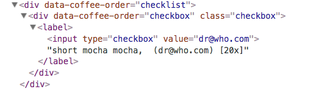

# Chapter 11, Data to DOM

Today we will learn how to use jQuery to dynamically update the document
(sometimes called the DOM, somewhat confusingly).

Next time, we'll backtrack a bit to learn about Grid Systems, Skeleton and
Bootstrap.  You might want to re-read Chapter 9, this time focussing on
the Bootstrap aspects.

## Plan

1. Admin
1. Modules
1. Chapter Recap:
    1. Creating Elements
    1. Searching the Tree up/down
    1. Event Delegation
1. Your questions
1. Activities from Chapter 11
1. input values
1. Assignment 8
1. Cloning (if there's time)

## Chapter Demo

Here's what coffeerun looks like at the end of [chapter 11](../../front-end-dev-resources/book-solutions/Chapter-11/coffeerun/index.html)

## Chapter Recap

This chapter covers the following ideas and techniques:

1. Creating branches of structure (HTML elements with attributes) and
adding them to the document. Coffeerun does this to add checkboxes for
pending orders
1. Adding an event handler for elements that finds the appropriate node by
searching up/down the tree. They add a click handler to indicate that a
coffee order is complete that removes it from the tree.
1. delegating the event handler to a static ancestor. They add the click
handler to a container DIV.
1. Some complicated modularity. Note that there is a `Row` constructor
that is entirely private to the `CheckList` module, which is
*global*.

We'll look at the code in [checklist.js](../../front-end-dev-resources/book-solutions/Chapter-11/coffeerun/scripts/checklist.js)

## Creating elements

We can build a simple node like this:

`$("<form>")`

(jQuery is smart enough to do the right thing, so the closing tag is optional.)

To build a node with attributes, supply a JS object literal with the
attribute names and values:

`$("<input></input>", {'type': 'checkbox', 'value': 'fred'})`

You *could* put the attributes into the same string with the tag, but then
you have to worry about embedded quotation marks and such. It's usually
easier to let jQuery construct the element for you, *especially* if any of
the attributes or their values are *dynamic*.

We put these together using jQuery's `.append()` method:

```
:::JavaScript
var $form = $("<form>",
               {'method':'post', 'action': url});
var $input = $("<input></input>",
               {'type': 'checkbox', 'value': 'fred'});
$form.append($input);
```

Here's the book's code for adding a row containing a checklist. Note that
the value of the checkbox is a dynamic value.

```
:::JavaScript
  function Row(coffeeOrder) {
    var $div = $('<div></div>', {
      'data-coffee-order': 'checkbox',
      'class': 'checkbox'
    });

    var $label = $('<label></label>');

    var $checkbox = $('<input></input>', {
      type: 'checkbox',
      value: coffeeOrder.emailAddress
    });

    var description = coffeeOrder.size + ' ';
    if (coffeeOrder.flavor) {
      description += coffeeOrder.flavor + ' ';
    }
    description += coffeeOrder.coffee + ', ';
    description += ' (' + coffeeOrder.emailAddress + ')';
    description += ' [' + coffeeOrder.strength + 'x]';

    $label.append($checkbox);
    $label.append(description);
    $div.append($label);

    // somebody else adds it to the DOM
    this.$element = $div;   
  }
```

You can send an arbitrary string of HTML to jQuery to build into
structure, but I don't recommend this. Using a more structured approach
avoids difficult-to-find bugs.

Here's what they built:

<figure>
   
   <figcaption>Coffee Run at the end of Chapter 11</figcaption>
</figure>

## Searching Down and Up the Tree:

Their code from the chapter:

```
:::JavaScript
  CheckList.prototype.removeRow = function (email) {
    this.$element                                 
      .find('[value="' + email + '"]')            
      .closest('[data-coffee-order="checkbox"]')  
      .remove();                                  
  };
```

This example also shows the power of jQuery.

## Event Delegation

Event delegation is designed for dynamically changing lists.

Also, I should talk about `event.target` and `this`. I added another
example to the [supplemental reading](../../reading/ch11.html)

Put an event handler on a static ancestor and delegate all the event
handling to it. 

This works because events *bubble* up the tree of a document.

In the coffeerun example, the event will bubble up from the checkbox to
the checklist container:

```
 <div data-coffee-order="checklist">            
 </div>
```

Their code that uses event delegation and `bind`, so the `this` in the
event handler is a `CheckList` object.

```
:::JavaScript
CheckList.prototype.addClickHandler =
    function (fn) {
        this.$element.on('click',
            'input',
            function (event) {
                var email = event.target.value;
                this.removeRow(email);
                fn(email);
            }.bind(this));
  };
```

## Questions

I'll answer [your questions](../../quizzes/quiz14.html)

## Book Activities

Let's take the remaining time to do the activities in Chapter 11.

Remember, the goal is to understand the point of each step, so please
discuss with your partner and ask me if you have any questions. Don't
just go through the motions.

## Input Values

In Chapter 10, we learned how to serialize all of a form's values into an
array of objects, and then iterate over that array to assemble them all
into a single object.

That's a fine technique, but if you just want *one* value, there's an
easier way. jQuery has a [`.val()`](https://api.jquery.com/val/) method
that can get and set the value of an input:

To get the value, assuming you can select the control:

`$(selector).val()`

For example:

`$("[name=zip_code]").val()`
`$("[name=pizza_size]").val()`

This method works on text `input` elements, `select` (drop-down menus),
and `textarea` elements.

For radio buttons and checkboxes, you can use the `:checked` pseudo-class
to get the value of the one that was checked:

`$('input[type=radio][name=size]:checked').val();`

You'll need to use `.val()` for the next assignment (assignment 8)

## Assignment 8 Quizzes

I'll demo assignment 8

## Cloning

If you're creating a *lot* of structure, even the compact jQuery code can
become a little tedious. Instead, we can use *cloning*. Here's a
non-trivial bit of HTML code to create a generic checkbox, with a lable
element but nothing *in* the label.

```
<div id="template">
   <div data-coffee-order="checkbox"
        class="checkbox">
       <label>
           <input type="checklist" value="">
       </label>
   </div>
</div>

<div data-coffee-order="checklist">            
</div>
```

With cloning, you can copy all that structure, modify it, and then graft
it onto the document:

```
:::JavaScript
function makeRow(coffeeOrder) {
    var $clone = $("#template > div").clone();
    var desc = ...;
    $clone.find("label").append(desc);
    $clone.find("input")
           .attr("value", coffeeOrder.emailAddress);
    $element.append($clone);
}
```

The template HTML could be much more complex, and the code to clone,
modify, and append it doesn't get any more complex.

## End of Class

At the end of each class, I'll hand out paper slips. On it, please write
*your name* and one of the following:

* A question you have about the material of the day
* Something you learned
* A suggestion
* An "I'm okay" statement

