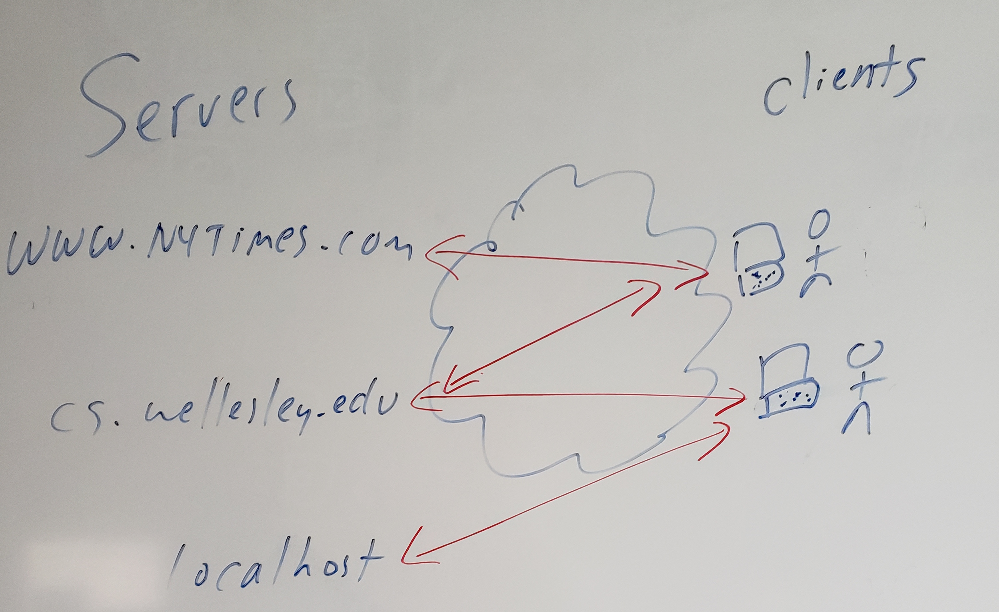

# Development Environment

CodeAnywhere seemed promising, but hasn't worked out.

## Goals

What do we want and need?

* editor: an intuitive, point-and-click editor, like Atom or the built-in editor
  that CodeAnywhere used
* preview: a way to see what a page looks like in a web browser, usually
  delivered from a web server
* cloud storage: a way for your files to be stored in a neutral location
  in the cloud, such as a CodeAnywhere container or the CS server, Tempest

Atom gives us an editor, but not preview or cloud storage.

The combination of Atom and a local web server using Python gives us the
first two, but not the third.

We'd like something that does all three.

## Concepts/Big Picture

Let's talk about some of the concepts underlying that last section:

* The web works with a client-server architecture.
* The clients are web browsers (and similar kinds of software). They
request stuff (files like HTML files, CSS files, JavaScript files, images,
videos, and such) from <em>servers</em>.
* A *web server* listens to the network, gets
requests from clients, and sends back responses (the requested files or error codes
like 404 file not found and 403 permission denied).

<figure>

<figcaption>Clients and Servers</figcaption>
</figure>

Last time, we used python to create a simple web server, serving files
from the directory it ran in. That's find for most of what we will do in
class, but it doesn't give us the cloud storage that we want.

From now on, we'll work with files on Tempest (cs.wellesley.edu).

## Visual Studio Code

Visual Studio Code is an editor that, with an extension pack, can edit
files on remote machines. We'll use it to edit files on Tempest, the CS
department server. 

This also has the pleasant side effects that (1) your files are backed up,
(2) you can keep them until you graduate, and (3) it doesn't cost the
department. 

Follow [these instructions](../../reading/visual-studio-code.html) to install
VSC and the remote development extension

## Catching up

Last time, our goal was to build a simple web page. To help us catch up,
and to learn a bit of how we will use VSC in our course, let's follow the
following steps. I'll explain each step.

1. Launch VSC and connect to `youracct@cs.wellesley.edu`. I've checked
that all of you who are enrolled in the course have a "shell" account
(meaning you can run commands on the server).
1. Click the "file explorer" icon and then on your account
1. You'll see a folder called `public_html`. That folder, by definition,
is where all your web pages go.
1. Click `public_html` to open it
1. Click the "new folder" icon and create a folder called `cs204`

Now we're going to switch to the terminal for a bit, because certain
commands are much easier that way. They are *unix* commands, which are
worth learning in their own right. 

1. Choose "Terminal / New Terminal" This will connect you to the CS server and put you in
your home directory.
1. Do an `ls` command. That will list your current directory. You might
see some 111 or 115 folders. You'll definitely see a `public_html`
folder. That folder is, by definition, where web pages go.
1. Do a `cd public_html` command. That puts you "in" that directory.
1. Do an `ls` command to see what's in that directory. You'll see at least
the `cs204-assignments` folder and the `cs204` folder that you just created.
1. Do a `cd cs204` command. That puts you in that folder.
1. Do `cp ~cs204/pub/downloads/Chapter02.zip .` That copies a zip file from
the course directory to your current directory.
1. Do `unzip Chapter02.zip` and all those files will get unpacked.
1. In the file browser, click on the `cs204` folder and you'll see the
new folders and files.
1. Navigate down to the `index.html` file and open it. You'll now be able
to edit it using VSC!

Here's what that sequence of commands looks like:
<pre style="background-color:black;color:white;border:2px solid gray">
New CentOS 7 [cs204guest@tempest ~]$ ls
cs111    cs115     public_html
New CentOS 7 [cs204guest@tempest ~]$ cd public_html
New CentOS 7 [cs204guest@tempest public_html]$ ls
cs204     cs204-assignments
New CentOS 7 [cs204guest@tempest public_html]$ cd cs204
New CentOS 7 [cs204guest@tempest cs204]$ cp ~cs204/pub/downloads/Chapter02.zip .
New CentOS 7 [cs204guest@tempest cs204]$ unzip Chapter02.zip
...
</pre>

## The Web Browser

Now switch to a web browser (Chrome, Firefox or Safari, but I recommend
Chrome, since the book will teach us the Chrome Developer tools).

Visit the following URL, substituting your account name:

`https://cs.wellesley.edu/~youracct/cs204/Chapter-02/ottergram/`

You should see a copy of the Ottergram solution from Chapter 2!

## Practicing Editing

Let's practice our development cycle:

1. Go to VSC
1. Edit the index.html file. I changed the H1 at the top to be *Scott's Ottergram*
1. Save the file
1. Go to Chrome
1. shift+reload to reload the page from the server. Do you see your change?

## Closing up

When you're done with some editing:

1. Use the `exit` command to close any terminals you opened
1. Click on the SSH connection bar in the lower left and choose "close connection"
1. Quit Visual Studio Code

## Topics we didn't get on Friday:

* Chrome Developer Tools

I'll show you

* DOM tree view
* styles pane
* arranging the DevTools
* dynamically changing styles

Here is our [solution to chapter
  2](../../front-end-dev-resources/book-solutions/Chapter-02/ottergram/index.html)

We'll look at the solution in terms of:

    * files,
    * folders
    * links/urls
    * DOM
    * Chrome Developer Tools
