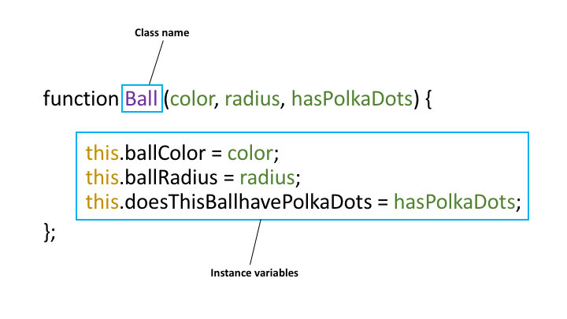
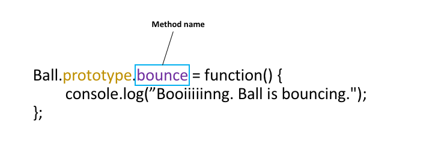
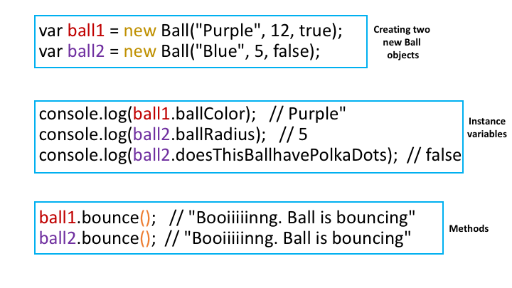

# Introduction to Object Oriented Programming
    
Many of you are already familiar with the ideas of Object-Oriented
Programming (OOP), but let's review so that it's fresh in our minds

## General Idea
        
In OOP, an *object* is a kind of value (data structure) that can have two
important characteristics:
        
*State*: This is information describing the object. For example, a ball
 object could be have a state like: being color red, have a radius of 12
 inches, and have polka dots.
    
*Behavior*: This is the information describing the actions of the
object. For instance, a ball object can bounce.
        
In order to create specific objects, we need to describe a *class* of
objects and then create some *instances* of the class.  (Note that these
are different from the HTML classes!) Imagine a class as a general *kind*
of thing, and objects are the specific instances of that kind. Here are
some examples of classes and objects.

<ul>
            <li><b>Class</b>: Ball</li>
            <ul>
            <li style="list-style: none;"><b>Objects</b>:</li>
            <li>ball1: Red, has a radius of 12, has polka dots, bounces</li>
            <li>ball2: Blue, has a radius of 5, does not have polka dots, bounces</li>
            </ul>
</ul>
        
<ul>
            <li><b>Class</b>: Wellesley College Student</li>
            <ul>
            <li style="list-style: none;"><b>Objects</b>:</li>
            <li>stu1: Beatrice, Class of 2019, MAS major, says "hello!"</li>
            <li>stu2: Jackie, Class of 2018, biology major, runs to lab</li>
            <li>stu3: Kate, Class of 2020, English major, sings</li>
            </ul>
</ul>

        
## Programming Classes and Objects
        
In discussing how to implement Object-Oriented Programming in JavaScript,
we have a choice. In 2015, the JavaScript language was expanded to include
specialized syntax to support classes and objects. That was pretty new
when our book came out, and so our book does not discuss it. Moreover,
older browsers might not support the new syntax (though there are tools
that can convert the new syntax to the old syntax). Therefore, it's useful
to understand the old way of doing OOP in JS.

However, I will start with the new syntax because it is simpler and easier
to understand. In fact, that's its purpose: to be a better syntax for an
existing implementation. This is sometimes called [syntactic
sugar](https://en.wikipedia.org/wiki/Syntactic_sugar). So, for that
reason, we'll introduce the new syntax first, and then proceed to the
older syntax that means the same thing.

## Modern Syntax

In this presentation, I've followed the [Mozilla Developer's Network web
docs on
Classes](https://developer.mozilla.org/en-US/docs/Web/JavaScript/Reference/Classes),
but that document isn't intended for novices. Nevertheless, you're
welcome to read it if you want more depth and rigor.

Let's describe our ball objects using the `class` syntax:

```
:::JavaScript
class Ball {
    constructor(color, radius, hasPolkaDots) {
        this.ballColor = color;
        this.ballRadius = radius;
        this.doesThisBallhavePolkaDots = hasPolkaDots;
    }
    getColor() {
        return this.ballColor;
    }
    setColor(color) {
        this.ballColor = color;
    }
    bounce() {
        console.log('Booiiiinng. Ball is bouncing.');
    }
}

// examples of creating two instances of the class
var ball1 = new Ball("Red", 12, true);
var ball2 = new Ball("Blue", 5, false);

// examples of invoking a method
console.log(ball1.getColor()); // "Red"

ball1.setColor("Green");

console.log(ball1.getColor()); // now "Green"

// example of retrieving an instance variable
// it would be better to define a method to do this
console.log(ball2.ballRadius); // 5
```

Some observations:

* a class has a special function called a *constructor* which initializes
  the *instance variables* of each new object (instance of the class). The
  constructor is automatically invoked whenever you create a new instance.
* a class can have any number of *methods*. Here we have three:
  `getColor`, `setColor` and `bounce`.
* a method is invoked by giving the object (or a variable containing the
  object) a *dot* and the name of the method, along with parentheses
  around any arguments to the method. As with function invocation, there
  are *always* parentheses, even if there are no arguments to the method.
  Indeed, that's because a method is just a special kind of function.
* we use the `new` operator when creating an instance of a class. The
  `new` operator creates the new, empty, object, binds it to `this` and
  then invokes the constructor. The constructor can then initialize the
  object by using the magic variable `this`.
* similarly, methods can refer to the object using `this` in their
  code. The `this` variable above is always the object in `ball1` but we
  could easily invoke a method on `ball2`.

You can see that code in action using the [ball modern
demo](ball-modern.html). Note that the web page will be blank. View the
page source to see the JS code, and open the JavaScript console to see
what was printed to the console.

Type in the names of the two variables, `ball1` and `ball2` to see how
they are displayed.

There are other features of the new syntax that we won't go into now, but
we may look at later in the course.

## Classic Syntax

Let's revisit our ball example but without the helpful syntactic
sugar. Remember that the ideas and implementation is the same.

```
:::JavaScript
function Ball(color, radius, hasPolkaDots) {
    this.ballColor = color;
    this.ballRadius = radius;
    this.doesThisBallhavePolkaDots = hasPolkaDots;
};

Ball.prototype.getColor = function() {
    return this.ballColor;
};

Ball.prototype.setColor = function(color) {
    this.ballColor = color;
};

Ball.prototype.bounce = function () {
    console.log('currently bouncing');
};

// examples of creating two instances of the class
var ball1 = new Ball("Red", 12, true);
var ball2 = new Ball("Blue", 5, false);

// examples of invoking a method
console.log(ball1.getColor()); // "Red"

ball1.setColor("Green");

console.log(ball1.getColor()); // "Green"

// example of retrieving an instance variable
// it would be better to define a method to do this
console.log(ball2.ballRadius); // 5

ball1.bounce();  // Booiiiiinng. Ball is bouncing
ball2.bounce();  // Booiiiiinng. Ball is bouncing
```        

You can see that code in action using the [ball classic
demo](ball-classic.html). Again that the web page will be blank. View the
page source to see the JS code, and open the JavaScript console to see
what was printed to the console.

Let's break the code into sections. The first 5 lines of this code are:
        
<p></p>

The *class name* is `Ball`, as indicated by the box and purple in the
picture. By convention, class names are always capitalized. When creating
a Ball using `new`, it needs to be given a color, a radius, and whether or
not it has polka dots, as shown by the green. The code with the keyword
<code>this</code> indicates that you are storing the green parameters
(color, radius, hasPolkaDots) to the <b>instance variables</b> (ballColor,
ballRadius, doesThisBallHavePolkaDots). The instance variables describe
the properties or <b>state</b> of the object, as described earlier in this
reading.
        
Comparing this to the modern syntax, we see that the capitalized function
plays the role of both class and constructor function.

Now let's turn to methods. 


        
Just as instance variables describe state, <b>methods</b> describe the
<b>behavior</b> of the object. Here, the name of the method is bounce as
indicated by the box and the purple.  When a ball bounces, it logs
"Booiiiiinng. Ball is bouncing." When you create new methods, you always
preface the function with the name of the class (in this case, Ball) and
the key word <code>prototype</code>.
        
Comparing this to the modern syntax, we see that methods are defined as
properties of the *prototype* property of the class (constructor
function). Every instance gets the class as its prototype, so putting
methods as properties of the prototype means that every instance gets
those methods.

Here are some examples:



<p>After you create the Ball class, you can create specific
<b>instances</b> of Ball objects.  The first two lines of code create
ball1 and ball2, each with its own characteristics. Notice that when you
create brand new objects, you must use the keyword <code>new</code>.  The
next three lines of code accesses the different instance variables. For
example, ball1 is purple. Finally, the last two lines of code access the
method of the Ball class.  Both ball1 and ball2 have the method bounce, so
they will behave the same way.  Notice that when you access methods, you
must use parentheses at the end! (as shown by the orange).</p>
        
Furthermore, if you compare the old syntax with the new, you'll see that
*using* OOP (creating instances and invoking methods) are exactly the same
between the two. The new syntax just makes it easier to describe the
class, its constructor and methods.

<hr>

<h3>Exercises</h3>

<p>1. Here is the Ball code in JSfiddle to explore. Open up JSfiddle and the console, and try creating new objects, accessing instance variables, and calling methods. Afterwards, try
creating new instance variables and methods to your liking.</p>
<iframe width="100%" height="500" src="https://jsfiddle.net/1ngdn481/3/embedded/js/" allowfullscreen="allowfullscreen" frameborder="0"></iframe> <br><br>

<p>2. Create your own Person class. Add instance variables and methods of your choices.</p>
      
