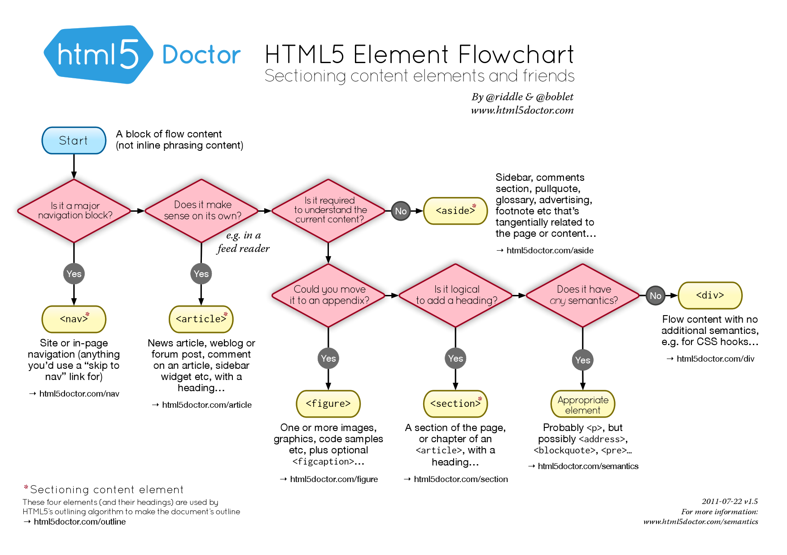

# Chapter 2 Companion

The first chapter on Ottergram does a nice job of introducing bits of HTML
as needed. Read that first. Here's an organized summary of what we
learned, plus a bit more.

## Languages

We learned that web pages are written using three languages

* HTML, which is the skelton and organs
* CSS, the skin and clothes. We'll look at that in the next chapter.
* JavaScript, which defines the behavior.  We'll get to that later.

## HTML template

Our basic page had the following template:

<pre>
&lt;!doctype html&gt;
&lt;html&gt;
    &lt;head&gt;
        &lt;meta charset="utf-8"&gt;
        &lt;title&gt;Ottergram&lt;/title&gt;
    &lt;/head&gt;
    &lt;body&gt;
        &lt;header&gt;
            &lt;h1&gt;Ottergram&lt;/h1&gt;
        &lt;/header&gt;
    &lt;/body&gt;
&lt;/html&gt;
</pre>

In Cloud 9, if you create an HTML page from a template, you get something
very similar.

You can visit this [template](template.html) and `file > save as` and then
upload to C9

## Tags

We learned the following tags. Look at W3Schools or MDN to learn more.

* `head` holds meta information about the document
* `meta` tells the browser the character set. More about this much later in the course.
We'll always use `utf-8`
* `title` is used for window titles, bookmarks, and is used by search engines. More important than you'd think.
* `body` holds all the content
* `header` holds headers and related stuff like logos
* `h1` holds the text of a major heading
* `link` connects a separate file of CSS rules to an HTML file. The URL of the CSS file is the `href` attribute.
* `ul` is a container for an unordered list (bullet list)
* `li` is a container for a list item
* `img` is replaced (a *replaced* element) with an image loaded from a separate file, specified using the `src` attribute.
* `a` demarks a clickable hyperlink

## Meaningless Tags

All the tags above have some kind of meaning associated with them. They
are *for* some kind of content. However, HTML also comprises two
meaningless tags, `span` and `div`. A `span` demarks some text or other
*inline* information. (Inline content is stuff like text that fills up a
line before flowing onto the next line.)  A `div` demarks a big block or
division of a document.

These tags are useful for styling and behavior (attaching JavaScript to
them).

## Chrome Developer

They described the Chrome Developer. This is how we look behind the matrix
to see what's really happening.

## Some other useful tags:

* `em` to emphasize some text. Typically is italic.
* `strong` which is like `em` but more so. Typically is bold.
* `h2` to `h6` for different levels of headers
* `p` for a paragraph. Can't nest or contain other block elements.
* `br` for a line break. Usually avoid this because it can break layouts
* `ol` for an ordered (numbered) list

Tags should be properly nested:

`<foo> <bar> </bar> </foo>`

not

`<foo> <bar> </foo> </bar>`

## Here links

Once, it was very popular on the web to have links like this:

  <ul>
    <li>Click <a href="http://google.com/search?as_q=apple+pie+recipes">here</a> for
    apple pie recipes
    <li>Click <a href="http://google.com/search?as_q=peach+pie+recipes">here</a> for
    peach pie recipes
    <li>Click <a href="http://google.com/search?as_q=prune+pie+recipes">here</a> for
    prune pie recipes
  </ul>

It seemed so clever and intuitive, making the clickable text be the
word "here."  There are two big problems with this, though:

* **Accessibility**: Screen-reading software for the
    blind often will read the text of the links on a page so that the user
    can easily navigate to other pages.  Links like those above read as
    "here," "here," "here" &mdash; useless.
* **Indexing**: Search engines pay special attention to
    the click text on a page, since those are often an important clue
    about the content of the destination page.  The links above don't show
    what the important words are.

So what do you do instead?  Just wrap the link tags around important
words:
  
  <ul>
    <li>Here are some <a href="http://google.com/search?as_q=apple+pie+recipes">
    apple pie recipes</a>.
    <li>Click here for <a href="http://google.com/search?as_q=peach+pie+recipes">
    peach pie recipes</a>.
    <li>Yo, check out the <a href="http://google.com/search?as_q=prune+pie+recipes">
    prune pie recipes</a>.
  </ul>

Accessibility is very important in this class, so keep that in mind.

## <span id="ALT">The ALT Attribute</span>

An IMG tag looks like this:

<pre>
&lt;img src="url/of/picture.jpeg" alt="picture of something"&gt;
</pre>

You noticed that we added an ALT attribute to the IMG tag that is a small
piece of text that can be used in place of the image in certain
circumstances.  The ALT attribute is an important part of the HTML
standard.  Perhaps its most important use supports <em>accessibility</em>.
Unfortunately, not everyone has good enough vision to see the images that
we use in our websites, but that doesn't mean they can't and don't use the
Web.  Instead, they (typically) have software that reads a web page to
them, including links.  When the software gets to an IMG tag, it reads the
ALT text.  If there is no ALT text, it may read the SRC attribute, hoping
there's a hint there, but all too often the SRC attribute is something
like <code>"../images/DCN87372.jpg"</code> and the visually impaired web
user is left to guess.

Therefore, you should always include a brief, useful value for the ALT
attribute.  If your page is an image gallery, then your ALT text could be
a description of the image.  However, describing the image is not, in
general, the idea.  For example, if the image is a link whose target is
made clear by the image, then the ALT text should say something like,
"Link to ..." so the user will know what to do with it.  The sole
exception is for images that are just used for formatting, such as blank
pictures that fill areas or colorful bullets for bullet lists.  In those
cases, in fact, it's better to include an ALT attribute that
is <em>empty</em>, so that the user doesn't have to listen to the SRC
attribute being read.  In both cases, the text should be useful for
someone who wants to use your site but isn't sighted.  It helps to turn
off images and view your site to check.

Furthermore, you should avoid having critical information on your website
conveyed only in images.  There may be times when it is unavoidable, but
to the extent that it is possible, we want our websites to be easily
usable by all people, including the blind and visually impaired.

Accessibility is important in modern society.  We build ramps as well
as stairs, we put cutouts in curbs, and we allocate parking spaces for the
handicapped.  Indeed, most federal and state government websites are
legally required to be accessible, and ALT attributes are just one part of
that.

In this class, we expect you to always use the
ALT attribute. If you find an image or an example where we've forgotten to
use one, please bring it to our attention.

For more information, you can read the following

<ul>

    <li><a href="http://www.htmlhelp.com/feature/art3.htm"> more thorough
    discussion of ALT </a>

    <li><a href="http://www.pantos.org/atw/35534.html">The Art of ALT</a>

</ul> 

## Figures

Now that we know about the `img` tag, it's useful to know about a semantic
tag that can be used with it. We can use `figure` to surround an `img`
tag, paired with `figcaption` for the caption text:

```
:::HTML
<figure>
    
    <figcaption>Hermione Granger as played by Emma Watson</figcaption>
</figure>
```

Here's what it would look like:

<figure>
    
    <figcaption>Hermione Granger as played by Emma Watson</figcaption>
</figure>

Note that images can be used without `figure`; a `figure` is often used as
in a book, where the text refers to a figure to provide additional
information. Also, the use of `figcaption` doesn't remove the obligation
to provide `alt` text. Still, this can be a useful tag to know about.

## <span id="comments">Comments</span> 

From the very first computer program, programmers have needed to
leave <q>notes</q> in the code to help themselves and others understand
what's going on or what the code's purpose is.  These notes are called
<em>comments.</em> Comments are a part of the program text (they're
not written separately, because then, well, they'd get separated),
but they are ignored by the computer. Comments aren't about what someone 
can discover by reading the code, but should cover the background context 
of the code, or its goal.

Because it's important to get in the habit of putting comments in your
HTML code, we will <em>require</em> comments in this course. At this
point, you won't have a lot to say, and that's fine.  You will start by
labeling each file with its name, your name, the date, and any sources you 
consulted (such as the source code of other web pages).  Think of this as
signing your work.  Later, when you're designing a website with many
coordinated pages, you can use comments on a page to talk about how it
fits into the overall plan. 

## <span id="html_comments">HTML Comment Syntax</span>

The HTML comment syntax is a little odd-looking.  Here's an example:

<pre>&lt;!-- I can say anything I want in a comment.  --&gt;</pre>

The syntax starts with a left angle bracket <code>&lt;</code> then an
exclamation point and two hyphens, then the comment (anything you want)
and ends with two hyphens and a right angle bracket <code>&gt;</code>.

## <span id="validation">Validation of HTML Code</span>

How can you be sure you've followed every nit-picky rule that the HTML
standards committee devised?  (The standards committee is the <a
href="http://www.w3.org/"><q>World Wide Web Consortium</q></a> or W3C.)
Even if you have memorized all the rules, checking a page would be tedious
and error-prone &ndash; perfect for a computer!  Fortunately, the W3C
created an <a href="http://validator.w3.org/">HTML validator</a>.  You can
validate by supplying a URL, by uploading a file, or even copy/pasting in
some HTML.  An HTML validator is an excellent tool to help you debug your
HTML code.


Validation also helps with accessibility.  One important aspect of
accessibility is having the proper HTML syntax for each page in your site.
Visitors with accessibility needs will use the alternative browsers and
screen readers, and that software will be aided by syntactically correct
HTML.  Read the following for a longer discussion of <a
href="http://validator.w3.org/docs/help.html#why-validate">why to validate
your HTML pages</a>.


Throughout the semester, if you need to validate a web page, you can
find the HTML validator and others in the [reference](../reference.html) page.

## <span id="valid_icon">Icon Declaring Validation</span>

Once you get your page to validate, you can put some HTML code on your
page to give it a <q>seal of approval</q>, declaring that it is valid (and
what standard it meets). You will see in lab examples of this strategy.  

The very cool thing about this icon is that it is clickable, and
clicking it will cause the validator to process your page again.  Thus,
you can modify your page, upload the changes, and click the icon to
re-validate it, making validation <em>very</em> easy.  In fact, we suggest
that you put the icon on your page <em>before</em> it's valid, and use it
during your debugging process.

The snippet of code is just the following, so go ahead and copy/paste it
into your pages. The code doesn't use anything we don't know, so read it!

<pre class="prettyprint lang-html">
&lt;p&gt;
  &lt;a href="http://validator.w3.org/check?uri=referer"&gt;
     &lt;img 
       src="http://cs.wellesley.edu/~cs110/Icons/valid-html5v2.png"
       alt="Valid HTML 5"
       title="Valid HTML 5"  
       height="31" width="88"&gt;
  &lt;/a&gt; 
&lt;/p&gt;
</pre>

## <span id="need-for-meaningful-tags">The need for meaningful tags</span>

As we've said, HTML was designed to structure the content of a web page.
That explains the existence of tags like <code>&lt;p&gt;</code>,
<code>&lt;h1&gt;</code>, <code>&lt;ol&gt;</code>, etc. However, when web
developers started creating pages with a lot of content, it became clear
that to make better use of the available screen space, a way to organize
the page content in bigger chunks was needed. Then, CSS could be used to
arrange their position on the page. Therefore, the tag
<code>&lt;div&gt;</code> was born (short for <em>division</em>), which is
currently the most used (and overused) tag in every webpage. While this
seemed to have solved the page layout problem, HTML code became difficult
to understand, other computer programs (e.g. search engines) couldn't make
sense of all divs in a page, if they wanted to use the organization of the
page for inferring the meaning of the content.
          
HTML5 introduced a series of new tags that have meaningful names and can
be used universally to express what the content is about, beyond the
existing simple tags. Additionally, to make the pages more alive with
different kinds of content, several new tags that allow content to be
embedded in a page were also added.  In the following, we will give a
short summary of some of these tags. Try to make use of them in your
pages. They will make your code better and more readable to the programs
of the future.
            
## <span id="semantic">Semantic Tags</span>

Here is a list of new HTML5 tags that are known as semantic tags, because
their names have specific meaning. 
          
<table class="table table-bordered table-striped">
  <thead>
              <tr>
                <th>Tag Name</th>
                <th>Short Description</th>
          </tr>
        </thead>
  <tbody>
             <tr>
                <td><code>&lt;<a href="https://www.w3schools.com/tags/tag_headers.asp" target="_blank">header</a>&gt;</code></td>
                <td>Specifies a header for a document or section.</td>
              </tr>
              
               <tr>
                <td><code>&lt;<a href="https://www.w3schools.com/tags/tag_footer.asp" target="_blank">footer</a>&gt;</code></td>
                <td>Specifies a footer for a document or section.</td>
              </tr>
              <tr>
                <td><code>&lt;<a href="https://www.w3schools.com/tags/tag_section.asp" target="_blank">section</a>&gt;</code></td>
                <td>Defines sections in a document (e.g. chapters).</td>
              </tr> 
              <tr>
                <td><code>&lt;<a href="https://www.w3schools.com/tags/tag_nav.asp" target="_blank">nav</a>&gt;</code></td>
                <td>Defines a set of navigation links.</td>
              </tr> 
              <tr>
                <td><code>&lt;<a href="https://www.w3schools.com/tags/tag_aside.asp" target="_blank">aside</a>&gt;</code></td>
                <td>Defines content which is relevant but not central (e.g. callouts, sidebars).</td>
              </tr>  
              <tr>
                <td><code>&lt;<a href="https://www.w3schools.com/tags/tag_main.asp" target="_blank">main</a>&gt;</code></td>
                <td>Defines the main content of a page.</td>
              </tr>   
              <tr>
                <td><code>&lt;<a href="https://www.w3schools.com/tags/tag_article.asp" target="_blank">article</a>&gt;</code></td>
                <td>Defines independent, self-contained content (e.g., blog post, news story).</td>
              </tr>   
              
              <tr>
                <td><code>&lt;<a href="https://www.w3schools.com/tags/tag_abbr.asp" target="_blank">abbr</a>&gt;</code></td>
                <td>Indicates an abbreviation or acronym.
                  <p><code>&lt;abbr title="United Nations">UN&lt;/abbr&gt;</code></p>
                  <p>See an example in action in the paragraph below for the word W3C.</p>
                </td>
              </tr>               
              <tr>
                <td><code>&lt;<a href="https://www.w3schools.com/tags/tag_figure.asp" target="_blank">figure</a>&gt;</code></td>
                <td>Indicates an figure or other graphical content 
                </td>
              </tr>               
              <tr>
                <td><code>&lt;<a href="https://www.w3schools.com/tags/tag_figcaption.asp" target="_blank">figcaption</a>&gt;</code></td>
                <td>A caption inside a figure element
                </td>
              </tr>               
  </tbody>
</table>


## <span id="which-tag-to-use">Which Tag to Use?</span>

Given all the tags listed above, along with DIV, you might feel bewildered
as to which one to use. Here is a helpful [HTML5 sectioning flowchart from
html5doctor.com
](https://html5doctor.com/downloads/h5d-sectioning-flowchart.pdf). Click on
the image to see a larger version:

  <figure>
    <a href="../images/h5d-sectioning-flowchart.png"></a>
    <figcaption>HTML5 Sectioning Flowchart<p>Click on the image to see a
    larger version</figcaption>
  </figure>

## Review of URLs

In class, we learned about two kinds of URLs: relative and absolute:

* absolute URLs start with a slash (or `http` or `https`) and specify the
  same destination regardless of starting location
* relative URLs start with a name (or `..`) and specify a destination as a
  series of steps from the starting location

Relative URLs have the advantage that if the starting file and ending file
are moved to a different place, but continue to share the same
relationship (for example, they are in the same folder), then the relative
URL will continue to work after they are moved, while an absolute URL will
necessarily break.

Here are the rules for relative URLs:

1. a bare name, like `fred.html` is a file or folder in the same folder as
the starting point.
1. a slash means to go down into a folder. So `stuff/fred.html` means
that `stuff` is a folder in the current folder (by rule 1) and `fred.html`
is inside `stuff`
1. a `..` means to climb out of a folder and go to the parent folder. So
`../fred.html` means that `fred.html` is in the folder above the starting
point.

These rules can be combined to yield long relative URLs like
`../../africa/botswana.html` which is a file in the `africa` folder that
is two folders above this one.

## The End

This is just the beginning of HTML. There's a lot more you could learn,
but this will do for now.
