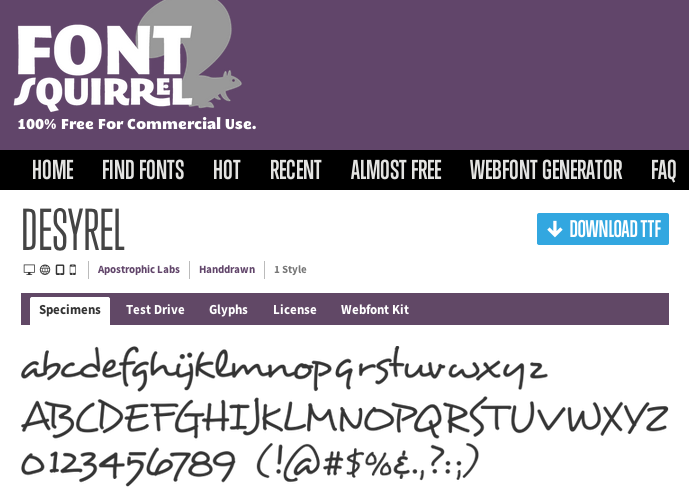

# Chapter 3 Supplement

Chapter 3 on Styles does a nice job of introducing bits of CSS as
needed. Read that first. Here's an organized summary of what we learned,
plus a bit more.

## CSS concepts

* [normalize.css](http://cdnjs.com/libraries/normalize/) removes some of
the formatting differences between browsers, making it easier to build consistent websites
* A CDN is a content delivery network, useful for lots of common files, including jQuery
* CSS rules, which include
    * selector(s)
    * properties and values

## CSS rules

```
:::CSS
header, footer {
    margin: 0;
    padding: 8px 4px;
    background: cornflowerblue;
    color: inherit;
}
```

## CSS Properties

* [background](http://www.w3schools.com/cssref/css3_pr_background.asp) background colors
* [border](http://www.w3schools.com/cssref/pr_border.asp) an optional box around the element
* [color](http://www.w3schools.com/cssref/pr_text_color.asp) font colors
* [display](http://www.w3schools.com/cssref/pr_class_display.asp) how an element is laid out on the page: `block` stacks vertically, `inline` is like text. There are other values, like `none` to act as if the element doesn't exist
* [font-family](http://www.w3schools.com/cssref/pr_font_font-family.asp) sets the font for the element
* [font-size](http://www.w3schools.com/cssref/pr_font_font-size.asp) sets the size of the font
* [list-style](http://www.w3schools.com/cssref/pr_list-style.asp) can change or remove the bullets in a bullet list.
* [margin](http://www.w3schools.com/cssref/pr_margin.asp) spacing outside the element's border
* [padding](http://www.w3schools.com/cssref/pr_padding.asp) spacing between the box and the contents
* [text-align](http://www.w3schools.com/cssref/pr_text_text-align.asp) can center text, right-align it and such
* [text-decoration](http://www.w3schools.com/cssref/pr_text_text-decoration.asp) can add or remove underlines and such
* [text-transform](http://www.w3schools.com/cssref/pr_text_text-transform.asp) can capitalize, lowercase or uppercase text
* [width](http://www.w3schools.com/cssref/pr_dim_width.asp) is the width of the *contents* of the element, *not including* any padding, borders or margins. This can be very confusing.


Several of the above are *shorthand* properties. You can be more specific,
like [border-left-style](http://www.w3schools.com/cssref/pr_border-left_style.asp)

## Box Model

The box model is most easily learned by playing with the dev tools, but the idea is simple:

* block elements work like big boxes that are (by default) stacked vertically on the page
* they have, outside to inside:
    * margins. These just have widths. They have the background color of the parent block
    * borders. These can have widths, styles, and colors
    * padding. These just have widths, but they take on the background color of this block
    * content. This has width and many other properties

You can use `display:block` as a declaration to turn a non-block element
(like A, IMG or SPAN) into a block element.

## Selectors

There are quite a few kinds of selectors available in CSS. Some are used
often, some only rarely. Here are some that are simple and very common:

* tag: style every such tag (e.g. paragraphs `<p>` or list items `<li>`) You have to specify one of the existing HTML tags, like `p`
* classes: style every element with that class. Make up a class name, say `fred` and use `.fred` as the selector. Specify the class with an attribute, like `<p class="fred">`
* id: style the (unique) element with that ID. Make up an ID, say `george` and use `#george` as the selector. Specify the id with an attribute like `<p id="george">`

Our book authors advocate avoiding ID. I don't really agree with their
reasoning, but their way is fine, too.  If something is definitionally
unique, I don't see a problem with giving it a unique ID.  Furthermore,
IDs are the only way to specify a location within a page using a URL.
Let's turn to that now.

## IDs

This section is *not* covered in the chapter, or indeed, in the book, as
far as I can tell. Still, it's worth explaining the &lt;a href="#"&gt;
that they used in Chapter 2.

This section is really about URLs. We learned that URLs uniquely specify a
single webpage in the world. URLs are even more powerful than that. They
can even specify a location within a page. This is done by doing two steps:

1. Giving the location an *ID*. That's done in HTML with the ID
attribute. Any element in HTML can be given an ID, like <span
id="george">&lt;span id="george"&gt;George Weasley&lt;/span&gt;</span>.
1. The absolute URL to specify that location is like
`http://domain.com/path/to/page.html#id-of-element` The `#` is a special
character (called a hash mark, sharp sign, pound sign) separating the URL
for the page from the ID of the element (called a *fragment*).

With relative URLs, you can omit things. So a within-page link to a
fragment would just be `#id-of-fragment`.

Try these two examples, and look at the location box in your browser:

* [link to george](#george)
* [link to this section](#ids)

When a web designer wants a link to the current page, they will usually
use `#` as the entire URL, letting everything default. Here's a link to
[this page](#).

## Attribute Selectors

You can select elements by their attributes:

* `a[href="#"]` selects anchors (hyperlinks) with an `href` attribute that has a hash as its value. 
* `a[href]` selects every hyperlink that has an `href` attribute (usually all of them would)
* `[href]` selects every element that has an `href` attribute, say hyperlinks and LINK elements

Attribute selectors aren't used much in CSS, but they're used a lot more
when we get to JavaScript and jQuery

## Structural Selectors

You can also combine these simple selectors. If A and B are both simple
selectors, you can do:

* A B: selects every B that is a descendant of every A
* A > B: selects every B that is a *child* of every A
* A ~ B: selects every B that follows (is a later sibling) of every
A. That symbol is a *tilde* (probably next to the exclamation point on your keyboards)
* A + B: selects every B that immediately follows (is the next sibling) of every A

## Multiple Selectors

If you have a declaration block that you'd like to have apply to more than
one set of elements, just list all the selectors before the block:

```
:::CSS
A, B {
    prop1: val1;
    prop2: val2;
}
```    

## Style Inheritance

Some CSS declarations (property-value pairs) are *inherited*, which means
they apply to all descendants of the selected elements. This is usually
pretty intuitive: font-size and background color are inherited, but border
is not.

## Color

Computers use a three-dimensional color system for colors. Every color is
composed of red, green and blue (RGB).  Consider a shade of
chartreuse. You can give it as:

* a name: <span style="background-color:chartreuse">background:chartreuse</span>
* an RGB triple of percentages: <span style="background-color:rgb(50%,100%,0%)">background-color:rgb(50%,100%,0%)</span>
* an RGB triple of values from 0-255: <span style="background-color:rgb(127,255,0)">background-color:rgb(127,255,0)</span>
* a hex value: <span style="background-color:#7fff00">background-color:#7fff00</span>

## Transparency

More recently, browsers support a four-dimensional system of colors, where
the fourth dimension is *transparency*, also called *alpha*. So the system
is RGBA.  Alpha is measured on a scale from 0 (perfectly transparent) to 1
(completely opaque). If you want to use transparency, though, your choices
are more limited:

<ul style="background-color:red">
<li> RGBA percentages: <span style="background-color:rgba(50%,100%,0%,0.5)">background-color:rgba(50%,100%,0%,0.5)</span>
<li> RGBA values: <span style="background-color:rgba(127,255,0,0.5)">background-color:rgba(127,255,0,0.5)</span>
</ul>


## Fonts

They explained how to download a font for your website and then to use it
using CSS.  It involves some incantations, so I won't repeat those here.
Eventually, you define a `font-family` that can then be used as a new
value for the CSS `font-family` property.

Some built-in values for `font-family` include:

<ul>
<li> <span style="font-family:verdana">verdana; the quick brown fox jumps over the lazy dog</span>
<li> <span style="font-family:arial">arial; the quick brown fox jumps over the lazy dog</span>
<li> <span style='font-family: "Times New Roman"'>Times New Roman; the quick brown fox jumps over the lazy dog</span>
<li> <span style="font-family: Georgia">Georgia; the quick brown fox jumps over the lazy dog</span>
<li> <span style="font-family: fantasy">fantasy; the quick brown fox jumps over the lazy dog</span>
</ul>

## Web Fonts

As we mentioned, with traditional fonts that come pre-installed in our
machines, we have only a limited number of choices (since the fonts need
to be installed in the machine of the viewers of the page too, not only
your own).  However, with web fonts (supported by all modern browsers)
there are new ways to deliver fonts (either by having your files as part
of your website, or by linking to other web servers) so that everyone can
see the pages with the font we intended. 
                
Be aware that not all fonts on the Web are free. For some of them you need
to pay.  Thus, it is better to start your search with one of the services
that aggregate fonts that are free for use. Such a website is [Font
Squirrel](http://www.fontsquirrel.com/), from which you can download the
fonts you like.

Suppose after browsing the available fonts, you decided to
use the handdrawn font [Desyrel](http://www.fontsquirrel.com/fonts/Desyrel)
            
<figure class="text-center">
     
              <figcaption>A screenshot from the FontSquirrel website showing the page for the Desyrel font.</figcaption>
            </figure>

Clicking on the "Download TTF" button, you can get the file with the font
(after unzipping), `desyrel.ttf`. Then, you can create a subfolder `fonts`
in the folder where your HTML and CSS files are stored and then use this
font as shown below:
                
```
:::CSS
@font-face {
       font-family: desyrel;
       src: url("path/to/desyrel.ttf") format("truetype");
       font-weight: normal;
       font-style: normal;
}

p {
       font-family: desyrel, cursive;
       font-size: xx-large;
}
```

<div>
<style scoped>
@font-face {
       font-family: desyrel;
       src: url("../css/desyrel.ttf") format("truetype");
       font-weight: normal;
       font-style: normal;
}

#desyrel { font-family: desyrel; }
</style>

<p id="desyrel">This sentence was written with the <em>Desyrel</em> font, downloaded from 
                  FontSquirrel.</p>
</div>

Unfortunately, things are not so simple. Because there are so many
browsers and platforms, to make sure that all of them will display the
desired font, we will need to provide the font in many different
formats. Thus, the rule for `@font-face` will look a bit more
complicated. The good news is that this code and all the files can be
automatically created for you by Font Squirrel, using its menu for
*WebFont Generator*, after you upload the file `desyrel.tff` (or some
other font).  Here is how the automatically generated CSS will look:
                
```
:::CSS
@font-face {
    font-family: 'desyrelregular';
    src: url('desyrel-webfont.eot');
    src: url('desyrel-webfont.eot?#iefix') format('embedded-opentype'),
         url('desyrel-webfont.woff') format('woff'),
         url('desyrel-webfont.ttf') format('truetype'),
         url('desyrel-webfont.svg#desyrelregular') format('svg');
    font-weight: normal;
    font-style: normal;
}
```

Notice that the files are referred directly, and you might need to add the
relative path to the folder you'll be storing these files.
         
If this looks like a lot of work, there is an easier way, that doesn't
involve having to keep the font files on our own server, we explain this
method in the next section.
               
## Google Fonts API

The easiest way to incorporate fancy fonts in your pages is to use the
free service provided by the [Google Fonts
API](https://developers.google.com/fonts/docs/getting_started)
                
* Find fonts that you like from the list of [Google Fonts](http://www.google.com/fonts),
 and click the button <q>Add to Collection</q>.
* On the bottom part of the browser, in the Collection tab, click on the button <q>Use</q> and
verify your choices.
* Copy the provided `&lt;link&gt;` code to your HTML file (it goes in the `head`
* Add the CSS code to the CSS rules you want.
                
You're done. Google takes care of providing all needed format files, you don't have to
provide such formats as part of your website.

Here is an example of the code you need to write to create the shadowed header below:

The `&lt;link&gt;` line goes into the HTML file:
                
```
:::HTML
<head>
    ...
    <link href='http://fonts.googleapis.com/css?family=Wallpoet' rel='stylesheet' >
</head>
```

The `font-family` style goes in the CSS file (inside the rule for the desired element):

```
:::CSS
  h2 {
      font-family: 'Wallpoet', cursive;
      font-size: 200%;
      color: black;
      text-shadow: 4px 4px 4px gray;
}
```
                
<div>
<style scoped>
      @import url(https://fonts.googleapis.com/css?family=Wallpoet);

       #wallpoet {
      font-family: 'Wallpoet', cursive;
      font-size: 200%;
      color: black;
      text-shadow: 4px 4px 4px gray;
      }
</style>
<h2 id="wallpoet">This header uses Wallpoet from Google Fonts</h2>
</div>
                
The font was created
    by [Lars Berggren](https://profiles.google.com/punktlars/about)
                
## Putting fonts into your CSS File
      
The previous code works fine, but if you have a dozen pages in your site,
and you want to use Wallpoet in all of them, every one of those pages
would have to have the `link` tag in the `head`. That is a lot of
redundancy and is contrary to our goal of stating the CSS information once
in the shared external CSS file.

What we can do instead is, in the Google Fonts browser, instead
of using the default `link` code, switch to the `@import` tab.

In that tab, you'll find code like this (it's the same URL as in the link):

```
:::CSS
@import url(https://fonts.googleapis.com/css?family=Wallpoet);
```

Copy/paste that into your shared CSS file, and you'll be able to use
Wallpoet in any file that uses that CSS file.

## Google Fonts can break HTML Validation

When you use several Google Fonts for a page, the URL generated by Google
contains the operator `|` to separate the different fonts. HTML doesn't
like such special characters, thus, your page will not deemed valid by the
W3 validator.  To fix this issue, you should replace the character
`|` with `%7C`.

