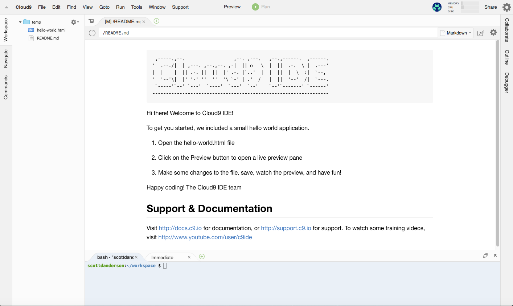

# Cloud 9

Cloud 9 is a service that allows you to create virtual machines
(workspaces) and Integrated Development Environments (IDEs) that are based
in the cloud. There is a free service which limits the power of your
machine (cpu, ram, disk) and also limits the number of private workspaces
you can have, but these are sufficient for our course.

## Signup

Signup is free and is like many other web accounts. You won't have any
difficulty with it.

I will send each student in the course an invitation using their Wellesley
email address. That will allow you to create a C9 account without having
to give a credit card.

(You're welcome to create a personal account, which is free, but I believe
they require a credit card anyhow, probably to ensure that you're not 13.)

Please create your C9 account before class, so that we don't have any
difficulties or delays during class.

## Workspace Creation

We'll do this in class together, but if you want to do it beforehand,
that's good too.

* put in a workspace name. Call it `cs204pub`
* the default is to make it public; that's fine
* the default template (HTML5) is good
* create the workspace by clicking the big green button

## Looking around Workspace

Here's what the workspace looks like:

<figure>
   
   <figcaption>The Cloud 9 Initial Workspace</figcaption>
</figure>

It has:

* Menus on the top like a desktop Integrated Development Environment (IDE)
  application. That will all you to create, edit, and save files,
* files and folders on the left hand side
* right hand side has links to share, collaborate, etc
* shell on the bottom, for executing commands. We won't use that a lot.
* A JavaScript Read-Eval-Print-Loop (REPL) is there on the bottom, too. We'll use that a lot.

## Using a Workspace

They have some "getting started" info. It's worth doing:

1. Open the hello-world.html file by double-clicking
1. Click on Preview button to see it live
1. Change something, save, and look at the preview
1. Note that there is a "refresh" button in the preview window to view
your changes.
1. have fun!

## Sharing

I can see exactly what you see if you share your workspace with me. (No
copying files around.)  Be sure to do the following:

* click `share` in the upper right, next to the big gear
* enter my email address `scott.anderson@wellesley.edu` as the person to invite
* the default is to share the workspace `RW` (read and write); that's fine

## Stuff to Notice

* yellow triangles in the margin are warnings
* red circles in the margin show errors (none yet; we'll make one)

