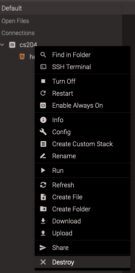
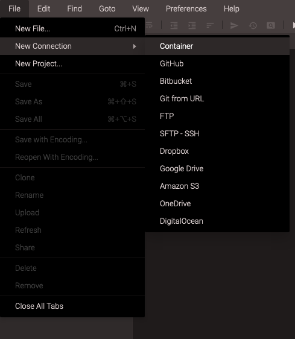
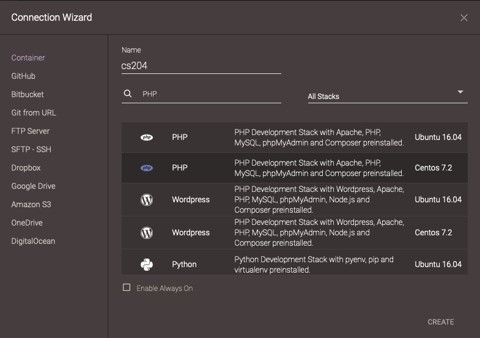
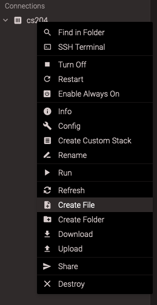
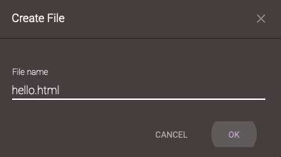
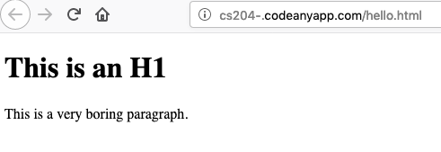

# Re-creating a Code Anywhere Container

These directions show how to destroy your current Code Anywhere container
and re-create it, and then test the "preview" feature. I hope the preview
feature will work; it did for the tutor and me.

## Step 1, Destroy your current container

Our starter plan limits us to one container, so to create a new one, we
have to destroy the old one. Fortunately, we don't have much to lose at
this point in the semester. If it's ever the case that we want to preserve
what's already there, see below.

Operations on containers are done using a context menu that we open with a
right-click (control-click on a Mac) on the name of the container in the
left hand pane of the editor window. You should see something that looks
like this, with the "destroy" item at the end of the context menu.

<figure>

<figcaption>Menu item to destroy the container</figcaption>
</figure>

Click there and confirm.  It only takes a minute or so to destroy the
container.

## Step 2, Create a new container

The next step is to re-create the container. We did this in class the
first day, and this will work the same way.

Go to File / New Connection / Container and click on that menu option. The
menu looks like this:

<figure>

<figcaption>Menu item to create a container</figcaption>
</figure>

## Step 3, Choose a Stack for the container

A container is a virtual machine: a complete operating system, a web
server, development environment and so forth. This is often called a "full
stack." There are different choices for each level of the stack. We will
choose a PHP environment running on a CentOS 7.2 operating system.

If you put "php" in the search box, it'll find the two stacks with that
environment, and you can choose the CentOS 7.2 option. Your screen will
look like this:

<figure>

<figcaption>Dialog box choose a stack for the container</figcaption>
</figure>

I suggest calling the container *cs204*

## Step 4, Create a file

Let's create a test file at the top level of our container. We can do that
using the container context menu (right click on the container name) and
choosing the "Create File" option:

<figure>

<figcaption>Context menu option to create a file in the container</figcaption>
</figure>

## Step 5 Name the file

The previous step will open a dialog window to name the file. Name it
`hello.html`. The window looks like this:

<figure>

<figcaption>Name the file</figcaption>
</figure>

## Step 6 Edit the File

The editor should automatically open an editor pane to that file, but if
it doesn't, click the file in the navigation pane on the left, just below
the container name.

Once it's open, copy/paste the following code into it:

```
<!doctype html>
<html lang='en'>
<head>
    <meta charset='utf-8'>
    <link rel='stylesheet' href='style.css'>
    <title></title>
</head>
<body>

<h1>This is an H1</h1>

<p>This is a very boring paragraph.</p>

</body>
</html>
```

Then save the file (command-S on a Mac).

## Step 6 Preview the File

Finally, let's try the preview feature. Right click (control click) on the
file's name to bring up a context menu and choose the top option, which is
"preview".

The browser will open a new tab and take you to it. That tab should show
the working file, like this:

<figure>

<figcaption>Preview Results</figcaption>
</figure>

## Saving Container Contents

If you need or want to save the contents of your current container before
you destroy it, you can do the following:

* right-click on the container to bring up the context menu
* choose the "download" item

This will download a file called `download.tar.gz` to your computer's
`Download` folder (on a Mac). That single file holds all the files and
folders from your container.

Once your new container is created, you can bring up the new container's
context menu and choose "upload" and select the `download.tar.gz`
file. You can then unpack the `tar.gz` file by doing the following:

* use the container's context menu to open an SSH terminal
* that creates a new pane in the right side of the editor window
* in that pane, type the following command `tar xzf download.tar.gz` That
will unpack the `tar.gz` file, but the editor won't know about the new
files and folders
* then, use the container's context menu and choose "refresh", which will
make it scan the workspace and discover all those new files and folders.


